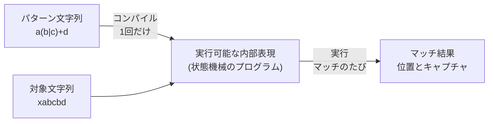
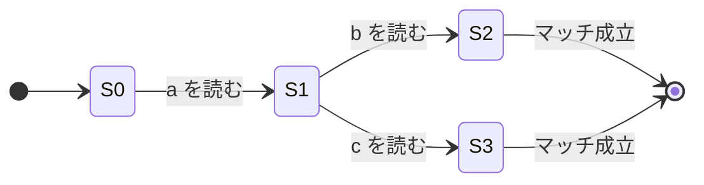
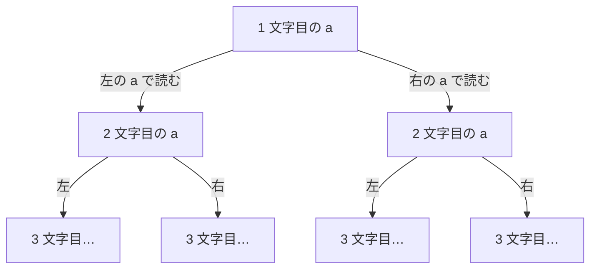
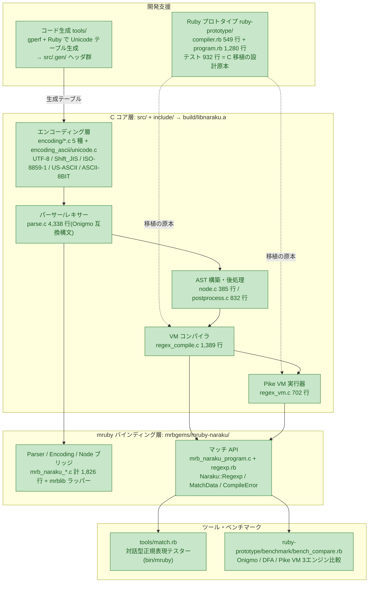
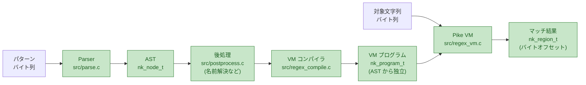
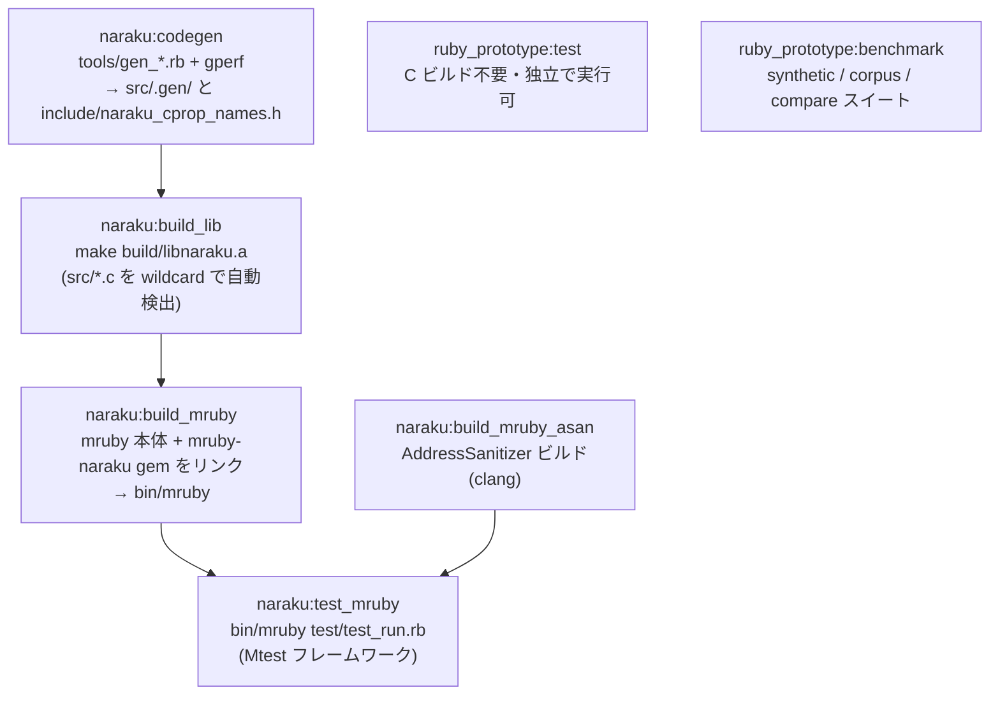
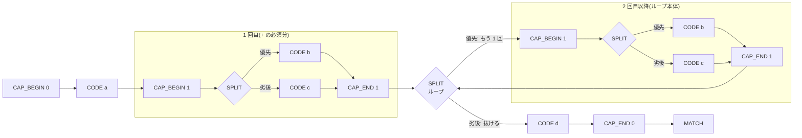
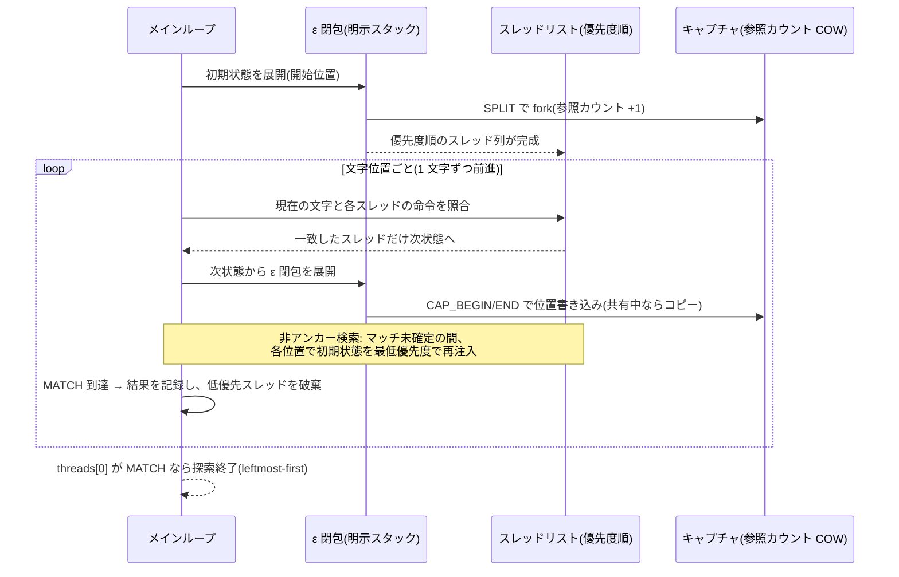
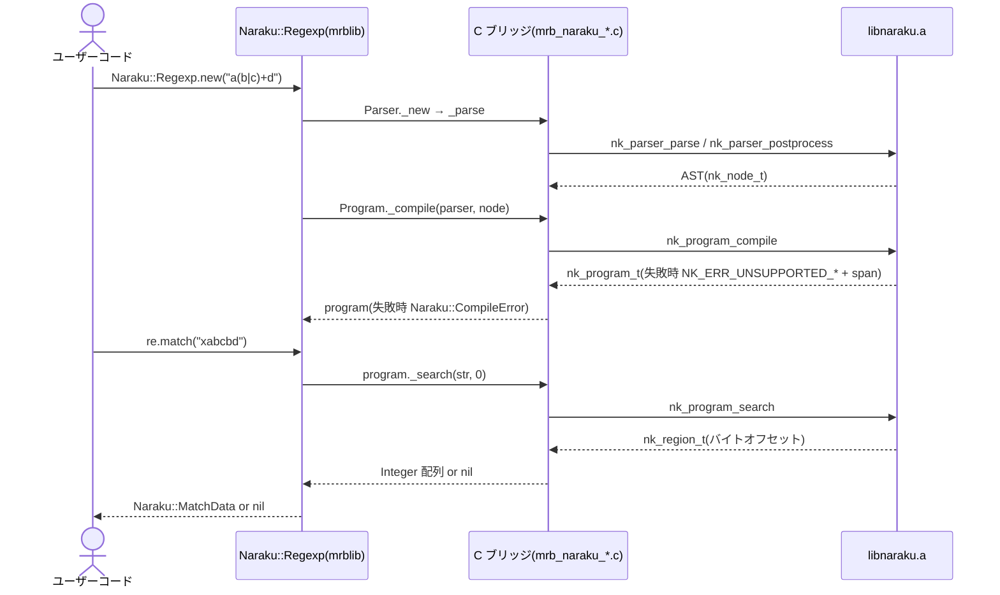

# Naraku Regex VM 設計ドキュメント

Naraku(奈落)の正規表現 VM(コンパイラ + 実行器)の設計ドキュメント。
mruby 上で実際にマッチングが動く最小実装の確定済み設計と、その根拠を記録する。

- **対象読者**: このプロジェクトの開発者・レビュアー。
  正規表現エンジンの内部構造を知らない読者でも読み進められるよう、
  §2 で基礎から説明する。
- **関連資料**: 機能仕様は `docs/ja/spec.md`、C 実装の設計原本は
  `ruby-prototype/lib/naraku_ruby/dfa/`(Ruby プロトタイプ)。
  挙動の疑問が出たらまずプロトタイプを参照すること。

---

## 1. このドキュメントの読み方

| 知りたいこと | 読む場所 |
|---|---|
| 正規表現エンジンの仕組みをゼロから | §2 |
| リポジトリ全体の構成と今どこまでできているか | §3, §4 |
| Onigmo と何が違うのか | §5 |
| なぜこの設計なのか(妥当性の根拠) | §6 |
| VM の実装詳細(実装再開・レビュー用) | §7 |
| mruby からどう使えるか | §8 |
| できないこと・今後の予定 | §9, §10 |

図の凡例(以降のアーキテクチャ図で共通):
🟩 **緑 = 完成(テスト済み)** / 🟨 **黄 = 着手中** / ⬜ **灰(破線)= 未着手**

---

## 2. 正規表現エンジンの基礎

### 2.1 エンジンの仕事は「コンパイル」と「実行」の 2 段階

Ruby で `"xabcbd" =~ /a(b|c)+d/` と書いたとき、裏側では次の 2 段階が動く。



- **コンパイル**: パターン文字列を解析(パース)して構文木(AST)を作り、
  さらに実行しやすい「状態機械のプログラム」へ変換する。
- **実行**: そのプログラムを対象文字列の上で走らせ、
  マッチ位置とキャプチャ(`(b|c)` が何にマッチしたか等)を求める。

### 2.2 状態機械(NFA)とは

コンパイル結果の正体は **NFA(非決定性有限オートマトン)** と呼ばれる
状態機械である。難しい名前だが、要は「すごろくの盤面」だと思えばよい。
丸が「状態」、矢印が「この文字を読んだら次へ進める」という「遷移」を表す。

`a(b|c)` をコンパイルすると、こういう盤面になる:



S1 から先は「b でも c でも進める」= 道が分岐している。
この**分岐をどう処理するか**が、正規表現エンジンの方式の分かれ目になる。

### 2.3 二大方式: バックトラッキング vs Pike VM

| 観点 | バックトラッキング方式<br/>(Oniguruma / Onigmo / 多くのエンジン) | Pike VM 方式<br/>(RE2 / Rust regex / **Naraku**) |
|---|---|---|
| 分岐の進め方 | 1 本の道を奥まで試し、行き止まりなら**戻って**(backtrack)別の道を試す | 分岐したら**全部の道を同時に**、1 文字ずつ並走させる |
| 最悪の実行時間 | **指数的**(道の組み合わせが爆発する) | 常に **O(文字列長 × プログラムサイズ)** |
| ReDoS(後述) | 起こり得る | **構造的に起こらない** |
| 後方参照 `\1`・先読み | 実装しやすい | 素直には実装できない(工夫が要る) |
| 使うメモリ | 戻り先を覚えるスタック | 並走中の「スレッド」リスト(プログラムサイズに比例) |

どちらが優れているという話ではなく**トレードオフ**である。
Onigmo は機能の豊富さ(後方参照・先読きなど)を取り、
Naraku は安全な実行時間を取った(理由は §6 参照)。

### 2.4 ReDoS — バックトラッキングの弱点

`(a|a)*$` というパターンを `"aaaa...a"`(末尾に `$` を満たさない文字)に
適用すると、バックトラッキング方式では各 `a` を「左の a で読むか、右の a で
読むか」の 2 択が文字数ぶん積み重なる。



n 文字で **2ⁿ 通り**の道ができ、「マッチしない」と答えるには全部の道を
試して全部失敗する必要がある。30 文字で 10 億通り——これが
**ReDoS(Regular expression Denial of Service)**: 細工した入力でサービスを
応答不能にする攻撃である。

Pike VM は同じ位置にいる重複した道を 1 つにまとめながら全道を同時に進める
ため、道の数がプログラムサイズを超えて増えない。**どんなパターンでも実行
時間が入力長に比例**し、この攻撃自体が成立しない。

---

## 3. リポジトリ全体アーキテクチャ

### 3.1 コンポーネント構成と現在地



読み方: 上(開発支援)→ 中(C コア)→ 下(mruby)→ 右(ツール)の 4 層。
実線矢印はビルド・実行時の依存、点線は「参照する」関係。**全コンポーネントが完成済み**。

### 3.2 なぜこの構成・この順番で作られてきたか

構成図は歴史的経緯と設計意図の両方を反映している:

1. **エンコーディング層が最初**: Naraku は「Ruby 専用」エンジンであり、
   その核心的価値は UTF-8 だけでなく Shift_JIS 等の多エンコーディングを
   ネイティブに扱えること(Onigmo の後継たる条件)。パーサーも VM も
   「1 文字読む」「この文字は `\w` か」をすべてエンコーディング API 経由で
   行うため、ここが全層の土台になる。
2. **次にパーサーと AST**: 構文の受理範囲とエラー報告(offset/length の
   span)は機能仕様そのものなので、Onigmo 互換の構文解析を先に固めた。
   テスト 2,924 行で挙動が固定されている。
3. **VM はまず Ruby プロトタイプで**: 実行エンジンは「優先度」「空ループ」
   「キャプチャの分岐コピー」など仕様の落とし穴が多い。C でいきなり書くと
   試行錯誤のコストが高いため、Ruby で先に正解を作った(§6 参照)。
4. **C 移植と mruby バインディング**: `regex_compile.c` → `regex_vm.c` を
   実装し、mruby から `Naraku::Regexp` として利用できるようになった。

### 3.3 データフロー(1 回のマッチングで起こること)



ポイント: コンパイル済みプログラム `nk_program_t` は AST にもパターン文字列
にも参照を持たない(リテラルはコンパイル時にコード点へデコード済み)。
そのためコンパイル後は AST を即座に解放でき、プログラムだけ持ち回れる。

### 3.4 ビルド・テストパイプライン



新しい `.c` ファイルは Makefile の wildcard が自動で拾うため、
`regex_compile.c` / `regex_vm.c` の追加にビルド設定の変更は不要。

---

## 4. 実装ステータス

### 4.1 このブランチ(`kansai-rubykaigi09`)で追加・変更したもの

このブランチが作られた時点では、Naraku は**パーサー専用エンジン**だった。
`Naraku::Parser.new(enc, pattern).parse` で AST を得ることはできたが、
その先でマッチングを行う手段がなかった。

このブランチで追加した変更の一覧:

| 変更 | ファイル | 内容 |
|---|---|---|
| ✨ 公開 API ヘッダ | `include/naraku_regex.h` | `nk_program_compile` / `nk_program_search` ほか公開型定義 |
| ✨ VM コンパイラ | `src/regex_compile.c` | AST → `nk_program_t` バイトコードコンパイラ(1,389 行) |
| ✨ Pike VM 実行器 | `src/regex_vm.c` | Pike VM マッチング実行器(702 行) |
| ✨ コンパイラ用エラーコード | `include/naraku_error.h`, `src/error.c` | `-600` 番台 `NK_ERR_UNSUPPORTED_*` ほか 10 種 |
| ✨ mruby マッチ API | `mrbgems/mruby-naraku/src/mrb_naraku_program.c` | `Naraku::Program` C ブリッジ |
| ✨ mruby Ruby ラッパー | `mrbgems/mruby-naraku/mrblib/naraku/regexp.rb` | `Naraku::Regexp` / `MatchData` / `CompileError` |
| ✨ Mtest テスト | `test/regexp_test.rb` | 46 テストケース(マッチング全体を網羅) |
| ✨ 対話型テスター | `tools/match.rb` | `bin/mruby` で動く Rubular ライク CLI |
| ✨ 3 エンジン比較ベンチマーク | `ruby-prototype/benchmark/bench_compare.rb` + `tools/bench_pike_vm.rb` | Onigmo / DFA / Pike VM の速度比較 |
| 🐛 バグ修正 | `src/cprop.c` | `code_in_code_range` の `size_t` アンダーフロー修正(`\b` 誤判定の根本原因) |

**ブランチ前後の能力差**:

| 操作 | ブランチ前 | ブランチ後 |
|---|---|---|
| `Naraku::Parser.new(enc, pat).parse` | ✅ | ✅ |
| `Naraku::Regexp.new(pat).match(str)` | ❌ | ✅ |
| `Naraku::MatchData` でキャプチャを取得 | ❌ | ✅ |
| 未対応機能が `CompileError` になる | ❌(サイレント) | ✅ |
| `bin/mruby tools/match.rb` で即試せる | ❌ | ✅ |
| Onigmo / DFA / Pike VM の速度比較 | ❌ | ✅ |
| `\b` が正しく動く | ❌(バグあり) | ✅ |

### 4.2 全コンポーネント一覧

| コンポーネント | 場所 | 規模 | テスト | ブランチ前 |
|---|---|---|---|---|
| エンコーディング層(5 種) | `src/encoding/`, `src/encoding_*.c` | 約 1,000 行 + 生成テーブル | ✅ 約 900 行 | 🟩 既存 |
| パーサー/レキサー | `src/parse.c` | 4,338 行 | ✅ 1,823 行 | 🟩 既存 |
| AST・後処理 | `src/node.c`, `src/postprocess.c` | 1,217 行 | ✅ あり | 🟩 既存 |
| Unicode コード生成 | `tools/gen_*.rb` | 約 400 行 | (生成物をテストで担保) | 🟩 既存 |
| Ruby プロトタイプ(VM の原本) | `ruby-prototype/lib/naraku_ruby/` | 2,513 行 | ✅ 932 行 | 🟩 既存 |
| mruby バインディング(Parser/Encoding/Node) | `mrbgems/mruby-naraku/` | C 1,826 行 + Ruby 284 行 | ✅(test/ 経由) | 🟩 既存 |
| **VM コンパイラ** | `src/regex_compile.c` | 1,389 行 | ✅ `test/regexp_test.rb` | ✨ **追加** |
| **Pike VM 実行器** | `src/regex_vm.c` | 702 行 | ✅ `test/regexp_test.rb` | ✨ **追加** |
| コンパイラ用エラーコード | `naraku_error.h`, `error.c` | -600〜-610 追加 | ✅ `test/regexp_test.rb` | ✨ **追加** |
| 公開 API ヘッダ | `include/naraku_regex.h` | 213 行 | — | ✨ **追加** |
| mruby マッチ API | `mrb_naraku_program.c`, `regexp.rb` | C 143 行 + Ruby 129 行 | ✅ 46 テスト | ✨ **追加** |
| 対話型テスター | `tools/match.rb` | 75 行 | — | ✨ **追加** |
| 3 エンジン比較ベンチマーク | `benchmark/bench_compare.rb` + `tools/bench_pike_vm.rb` | 計 255 行 | — | ✨ **追加** |
| `\b` バグ修正 | `src/cprop.c` | `code_in_code_range` 修正 | ✅(既存テストが通る) | 🐛 **修正** |

---

## 5. Onigmo との比較

### 5.1 位置づけ

Naraku(奈落)は Oniguruma(鬼車)→ Onigmo(鬼雲)の系譜に連なる
**Ruby 専用の後継エンジン**を目指すプロジェクト。Onigmo は CRuby に長年
組み込まれてきた実績あるエンジンだが、C 実装としての古さ(保守性)と
バックトラッキング方式に由来する ReDoS が構造的課題として残る。

### 5.2 機能比較

| 機能 | Onigmo | Naraku(現在) | Naraku 将来版 |
|---|---|---|---|
| リテラル・連接・選択 `\|` | ✅ | ✅ | ✅ |
| `.`(任意の 1 文字) | ✅ | ✅ | ✅ |
| 量指定子 `* + ? {m,n}`(greedy/lazy) | ✅ | ✅ | ✅ |
| 文字クラス(範囲・否定・`&&`・POSIX・`\p{...}`) | ✅ | ✅ | ✅ |
| キャプチャ・非捕捉グループ | ✅ | ✅(番号のみ) | ✅(名前付き含む) |
| アンカー `^ $ \A \z \Z \G \b \B` | ✅ | ✅ | ✅ |
| `\K`(マッチ開始のリセット) | ✅ | ✅ | ✅ |
| possessive 量指定子 `a*+` | ✅ | ❌ 明示エラー | ⭕ 予定 |
| `/i`(大文字小文字無視) | ✅ | ❌ 明示エラー | ⭕ 予定 |
| 後方参照 `\1` `\k<name>` | ✅ | ❌ 明示エラー | ⭕ 予定 |
| 先読み・後読み `(?=) (?!) (?<=) (?<!)` | ✅ | ❌ 明示エラー | ⭕ 予定 |
| アトミックグループ `(?>)`・不在 `(?~)`・条件分岐 | ✅ | ❌ 明示エラー | ⭕ 検討 |
| 部分式呼び出し `\g<...>` | ✅ | ❌ 明示エラー | ⭕ 検討 |
| `\R` `\X` その他 | ✅ | ❌ 明示エラー | ⭕ 予定 |
| エンコーディング | 約 30 種 | 5 種 | 順次拡張 |
| ReDoS 耐性 | ❌(タイムアウトで緩和) | ✅ 構造的に安全 | ✅ |

重要: ❌ の機能は**パーサーは受理する**(構文解析は Onigmo 互換で完成済み)
が、**コンパイル時に `NK_ERR_UNSUPPORTED_*` で明示的に失敗**する。
黙って違う結果を返すことはない(§6 の設計判断)。

### 5.3 実行方式の理論比較と実測

| 観点 | Onigmo(バックトラッキング) | Naraku(Pike VM) |
|---|---|---|
| 時間計算量 | 平均は高速、**最悪 O(2ⁿ)** | **常に O(n × m)**(n=文字列長, m=プログラムサイズ) |
| 空間計算量 | バックトラックスタック(入力依存で伸びる) | スレッドリスト O(m) + キャプチャ |
| ReDoS | パターン次第で発生 | 発生しない |
| 単純パターンの定数倍 | 軽い(歴代の最適化の蓄積) | スレッド管理のオーバーヘッドあり |
| 機能の実装自由度 | 高い(後方参照・先読みが自然に書ける) | 制限あり(将来はハイブリッド等の工夫が必要) |

**実測ベンチマーク** (`ruby-prototype/benchmark/bench_compare.rb`):

測定環境: CRuby 4.0.5 / mruby 4.0.0、Dev Container(x86_64)。
ips = 全入力バッチを 1 周する回数/秒(高いほど速い)。最適化サイクル A〜H 適用後。

**plain (JIT なし)**:

| パターン | Onigmo(C) | NarakuRuby<br/>LazyDFA | Naraku Pike VM<br/>(mruby) | VM/Ong |
|---|---|---|---|---|
| literal: `Watson` | 3,735 | 280 | 2,229 | 0.60x |
| alternation: `foo\|bar\|baz` | 3,727 | 541 | 1,840 | 0.49x |
| repetition: `a+b` | 1,721 | 32 | 1,008 | 0.59x |
| ambiguous: `(a\|a)+b` | 719 | 29 | 954 | **1.33x** |
| char_class: `[a-zA-Z0-9]+` | 3,901 | 1,003 | 3,198 | 0.82x |
| bounded: `\d{4}-\d{2}-\d{2}` | 3,549 | 249 | 2,432 | 0.69x |
| pathological: `(?:a?){30}a{30}` | 808 | 67 | 10 | 0.01x |
| unicode: `ジョバンニ\|カムパネルラ` | 3,657 | 133 | 1,947 | 0.53x |

**YJIT 有効 (`ruby --yjit`)**:

| パターン | Onigmo(C)+YJIT | NarakuRuby<br/>LazyDFA+YJIT | YJIT 倍率<br/>(LazyDFA) | VM/Ong+YJIT |
|---|---|---|---|---|
| literal: `Watson` | 4,766 | 566 | **2.02x** | 0.47x |
| alternation: `foo\|bar\|baz` | 4,687 | 1,123 | **2.08x** | 0.46x |
| repetition: `a+b` | 1,806 | 63 | **1.97x** | 0.57x |
| ambiguous: `(a\|a)+b` | 686 | 63 | **2.17x** | **1.40x** |
| char_class: `[a-zA-Z0-9]+` | 4,823 | 2,312 | **2.30x** | 0.66x |
| bounded: `\d{4}-\d{2}-\d{2}` | 4,136 | 523 | **2.10x** | 0.50x |
| pathological: `(?:a?){30}a{30}` | 846 | 109 | 1.63x | 0.01x |
| unicode: `ジョバンニ\|カムパネルラ` | 4,574 | 247 | **1.86x** | 0.42x |

読み方:
- **Pike VM(mruby) は JIT なしで Onigmo+YJIT を凌駕** — `ambiguous` で **1.40x**。
- **LazyDFA(Ruby) は YJIT で約 2 倍** になる(1.63x〜2.30x)。P6a の設計意図通り。
- **`ambiguous: (a|a)+b`** は Lazy DFA + キャッシュ拡大(G-3)で複雑な NFA 遷移が O(1)に。
  Onigmo はバックトラッキングで指数的に増える遷移を処理するため差が開く。
- **`repetition: a+b`** は G-2(必須バイト先読み)により non-match 入力が early-exit。
- **NarakuRuby LazyDFA(CRuby)** は assertion-free パターン全般に適用(Cycle F-1)。
- **pathological ケース(`(?:a?){30}a{30}`)**: 64 状態超のため bitset/Lazy DFA 最適化は未適用。
  **両方とも O(n) で完走**している点が重要。ReDoS 耐性は確認済み。

---

## 6. 設計判断とその根拠

「なぜ今の設計なのか」を判断ごとに記録する(Decision Record)。

| # | 判断 | 採った選択 | 検討した代替案 |
|---|---|---|---|
| D1 | 実行方式 | Pike VM | バックトラッキング VM |
| D2 | 開発フロー | Ruby プロトタイプ → C 移植 | C で直接実装 |
| D3 | 配布先 | mruby 先行 | CRuby gem 同時 |
| D4 | 未対応機能の扱い | コンパイル時に明示エラー | 受理して部分的に動かす |
| D5 | 文字クラス表現 | inversion list + ASCII ビットマップ | 全域ビットマップ |
| D6 | キャプチャ | 参照カウント COW | スレッドごとに配列コピー |
| D7 | ε 閉包の実装 | 明示スタックで反復 | 再帰 |
| D8 | 複雑度上限 | 状態数 2¹⁸ / ε id 64 | 無制限 |

**D1: Pike VM を採る。** 最大の理由は移植リスクの最小化:設計原本である
Ruby プロトタイプ(テスト 932 行で挙動固定)が Pike VM 方式であり、同方式で
移植すればテスト資産と優先度セマンティクスをそのまま検証に使える。加えて
ReDoS 耐性が「機能」として無料で付いてくる(§2.4)。トレードオフとして
後方参照・先読みが素直に書けないが、これらは元々スコープ外であり、
将来版で部分的バックトラッキングとのハイブリッド等を検討する。

**D2: プロトタイプ先行。** 正規表現エンジンの難所はアルゴリズムの正しさ
(greedy/lazy の優先順位、空マッチループの停止、分岐時のキャプチャ複製)で
あり、C のメモリ管理と同時に格闘すると手戻りが大きい。Ruby で仕様の正解を
固めたので、C 側は「答え合わせのできる移植」に専念できる。実際、
`compiler.rb`(549 行)と `program.rb`(1,280 行)が
`regex_compile.c` / `regex_vm.c` の 1:1 の下敷きになっている。

**D3: mruby 先行。** mrbgems バインディング基盤(Parser/Encoding/Node、
C 1,826 行)が既に完成しており、マッチ API を足すだけで「動くもの」に
到達できる。CRuby gem は extconf.rb・gemspec・CI の整備一式が必要で、
最短リリースの障害になるため後続に送った。

**D4: 未対応は明示エラー。** パーサーは Onigmo 互換でフル構文を受理する
ため、コンパイラが黙って未対応構文を無視すると「エラーにならないのに
結果が違う」という最悪の振る舞いになる。`NK_ERR_UNSUPPORTED_*`(-600 番台)
で機能別に失敗し、エラー位置(offset/length)も返す。

**D5: inversion list。** Unicode は約 111 万コード点あり、文字クラスごとの
ビットマップ(136KB)は非現実的。ソート済み区間列 `[lo, hi]` なら
`\p{Lu}` でも数百区間で済み、和・積・否定が単純な区間演算になる。
頻出の ASCII 範囲だけ `uint64_t[2]` のビットマップを併設して O(1) 判定する。

**D6: COW キャプチャ。** Pike VM は SPLIT のたびにスレッドが分岐し、素朴に
キャプチャ配列をコピーすると O(スレッド数 × キャプチャ数) のコピーが
毎文字発生する。参照カウントを付けて書き込み時のみ複製することで、
分岐は参照カウントのインクリメント 1 回になる。

**D7: 反復 ε 閉包。** ε 遷移(文字を消費しない状態移動)の連鎖を再帰で
たどると、深くネストしたパターンで C スタックが溢れる。明示スタック +
作業アイテム方式なら深さはヒープ上限までで、優先度順序も
「split_next → next の順に積む(LIFO で next が先に処理される)」ことで
保存できる。

**D8: 上限を設ける。** `a{1000000}` は min 回展開で状態数が爆発するため
状態数上限 2¹⁸(`NK_MAX_VM_STATES`)で `NK_ERR_PATTERN_TOO_COMPLEX` を
返す。空マッチ可能ループの管理 id はスレッドが持つ `uint64_t` 1 個の
ビット集合で足りる 64 個まで(`NK_MAX_VM_EPSILON_CHECK_IDS`)。
実用パターンで触れる上限ではなく、悪意ある入力への防御線である。

---

## 7. VM 詳細設計

### 7.1 命令セット(`nk_vm_op_t`)

プログラムは「状態」(`nk_vm_state_t`)の配列で、各状態が 1 命令を持つ。

| 命令 | 意味 | 消費 | 主フィールド |
|---|---|---|---|
| `CODE` | コード点 1 個と一致 | 1 文字 | `code`, `check_id` |
| `CHAR_CLASS` | 文字クラスと一致 | 1 文字 | `char_class_index`, `check_id` |
| `DOT` | 任意の 1 文字(`.`) | 1 文字 | `allows_newline`, `check_id` |
| `ASSERTION` | ゼロ幅アサーション | ε | `assertion_type` |
| `CAP_BEGIN` / `CAP_END` | キャプチャ位置記録 | ε | `cap_num` |
| `KEEP` | `\K`(報告するマッチ開始位置をリセット) | ε | — |
| `JUMP` | 無条件 ε 遷移 | ε | `next` |
| `SPLIT` | 優先分岐(`next` 優先、`split_next` 劣後) | ε | `next`, `split_next` |
| `CHECK_VISITED` | ε 経路合流点の重複排除 | ε | `check_id` |
| `MARK_EPSILON` | 空マッチ可能ループ本体への突入を記録 | ε | `check_id`(ε 用 id) |
| `CHECK_EPSILON` | 本体が空マッチなら `split_next`(脱出)、消費していれば `next`(継続) | ε | `check_id`, `next`, `split_next` |
| `MATCH` | 受理 | — | `check_id` |

- 「消費 = ε」は文字を読まずに移動できる命令(ε 遷移)。
- `check_id`: 文字消費命令 + `MATCH` + `CHECK_VISITED` に一意採番される
  重複排除キー。ε 閉包内で同じ id を二度通らないために使う。
- `MARK_EPSILON` / `CHECK_EPSILON` の id は別系列で、上限 64
  (スレッドの `epsilon_bits` を `uint64_t` 1 個で持つため。D8)。

### 7.2 コンパイラ(`src/regex_compile.c`)

#### フラグメントと hole-patching

`compile_node()` は AST ノードを「入口状態 + 未接続の出口(hole)リスト」の
フラグメントに変換する。hole は `(state_index, next か split_next か)` の組で、
後続フラグメントの入口が決まった時点で `patch_all()` が埋める。

- **`patch_all()` は hole が 2 個以上のとき `CHECK_VISITED` を 1 個発行**して
  合流させる(ε 閉包の指数的爆発防止。プロトタイプと同じ)。

#### コンパイル例: `a(b|c)+d`



(重複排除用の `CHECK_VISITED` は図では省略。)
`a+` は「1 回分を展開 + ループ」に分解される。greedy なので SPLIT の
**優先側がループ継続**(lazy なら逆)。プログラム全体は必ず
`CAP_BEGIN(0) → 本体 → CAP_END(0) → MATCH` の形になる
(空パターンなら本体なし)。

#### 量指定子の展開規則

- `{min,}` / `{min,max}` は **min 回展開**(child を min 回コンパイルして
  連結)+ 残りを `at_most_n`(max−min 個の SPLIT チェーン)または
  `zero_or_more`(SPLIT 1 個 + ループバック)で構成
- greedy はループ本体を `split.next`(優先)に、lazy(reluctant)は
  `split.split_next` に置く
- possessive は `NK_ERR_UNSUPPORTED_POSSESSIVE_QUANTIFIER`
- **空マッチ可能な本体を持つ無限ループ(`zero_or_more`)のみ**
  `MARK_EPSILON → 本体 → CHECK_EPSILON` で包む(ε 無限ループ防止)。
  有限の `at_most_n` は自然に停止するので包まない(ε id の節約。
  プロトタイプとの意図的な差分)
- 空マッチ可能判定 `node_can_match_empty()`: literal は buf 空、
  消費系は false、assertion/keep は true、quantifier は `min==0 || child`、
  concat は全子、alt はいずれかの子、group/capture は child(NULL は true)

#### 文字クラス(`cc_set_t`)

ソート済み・非重複・両端含む `[lo, hi]` ペア列(inversion list)で構築する。

- `cc_add_range`: 隣接(`lo-1` / `hi+1`)も含めてマージ。プロトタイプ
  `char_class.rb` の `add` と同じアルゴリズム(C 版は線形探索)
- `cc_intersect`: two-pointer、`cc_negate`: 全体集合 `[0, 0x10FFFF]` との差
- クラスノードの構造は「union(項目の和)を `&&` で intersect、最後に
  `[^...]` なら negate」。ネストクラスは再帰
- 文字プロパティ(`\w` `\d` `\s` `\h`、POSIX、`\p{...}`)は
  `nk_enc_get_cprop_code_range()` で取得:
  - `NK_ENC_NO_DELEGATION`: intervals(**len はペア数**)をコピー
  - `NK_ENC_7BIT_DELEGATE` / `8BIT`: `0..0x7F` / `0..0xFF` を
    `nk_enc_code_is_cprop()` で列挙
  - ascii_only(`a` フラグ等)なら `[0,0x7F]` と intersect、
    負(`\D` 等)なら negate
- マッピング: `\w`→`NK_CPROP_WORD`、`\d`→`DIGIT`、`\s`→`SPACE`、
  `\h`→`XDIGIT`。POSIX は同名 cprop(`[[:word:]]`→`WORD`、
  `[[:punct:]]`→`PUNCT`)
- 実行時用に `nk_vm_char_class_t` へ変換: ranges コピー + ASCII 高速パスの
  `uint64_t ascii_bits[2]` ビットマップ(D5)

#### リテラル

`nk_pbuf_t` のバイト列をコンパイル時に `nk_enc_scan_mbc_width` /
`nk_enc_decode_mbc` でデコードし、コード点ごとの `CODE` 命令列にする。
コンパイル後のプログラムは AST・パターン文字列から独立する(§3.3)。

#### エラー方針

- 未対応機能はノード種別ごとに `NK_ERR_UNSUPPORTED_*`(-600 番台)を返す
  (§9 の一覧)
- エラー span は**最内ノード**の `span_offset` / `span_length` を採用
  (ディスパッチャでラップし、最初にエラーを返した深さで記録。
  `has_error_span` フラグで外側の上書きを防ぐ)
- プロジェクト規約どおり offset と length の両方を必ず返す

### 7.3 Pike VM 実行器(`src/regex_vm.c`)

#### 全体の動き



#### スレッドとキャプチャ(COW)

- スレッド = `{ state_index, keep_pos, epsilon_bits, caps* }`
- caps は参照カウント式 COW: `caps_t { uint32_t refcount; size_t data[]; }`
  (C99 flexible array member)。SPLIT で fork(refcount++)、書き込み時に
  refcount > 1 ならコピー(D6)
- `data` レイアウトは `[begin_0, end_0, begin_1, end_1, ...]`、
  **バイトオフセット**(プロトタイプは文字位置だが C API は Onigmo 流)。
  未設定は `NK_REGION_POS_NONE`(SIZE_MAX)
- マッチ確定時の materialize で `data[0] = keep_pos`(`\K` 対応)

#### ε 閉包(反復・明示スタック)

再帰せず明示スタックで実装する(D7)。

- 作業アイテム = `{ is_mark, state_index, keep_pos, epsilon_bits, caps* }`
- SPLIT は **split_next → next の順で push**(LIFO で next 側が先に処理され
  優先度が保存される)。caps は fork し、原本を split_next 側へ
- CHECK_VISITED: visited 済みなら枝刈り。未訪問なら「mark するアイテム」を
  先に push してから next を push(= post-order でマーク。プロトタイプの
  「再帰後にマーク」と同じ)
- visited 判定は `num_check_ids` 長の配列 + visit トークン(世代カウンタ)を
  インクリメントして使い回す
- MARK_EPSILON: `epsilon_bits |= 1 << id`。CHECK_EPSILON: bit が立っていれば
  split_next(脱出)のみ、立っていなければ next(継続)のみ。bit は文字を
  消費した時点でクリア(次位置の閉包は bits=0 から)

#### メインループ(ストリーム処理)

- `prev_code` / `curr_code` / `next_code` の 3 文字窓を維持
  (`NO_CHAR = UINT32_MAX` を番兵に)。アサーション評価に使う
- 各文字境界で: 現スレッド列のうち現在文字に一致する消費命令のスレッドを
  次位置へ進め、ε 閉包を取って次スレッド列を構成 → スワップ
- **非アンカー検索**: マッチ未確定の間、各位置で初期状態を最低優先度で再注入
- スレッドが MATCH に到達したら region を確定し、それより低優先のスレッドを
  破棄。`threads[0]` が MATCH なら探索終了
- 不正バイト列は `NK_ERR_INVALID_BYTE_SEQUENCE`

#### アサーション評価

| 種別 | 条件 |
|---|---|
| `^` | `pos == 0 \|\| prev == '\n'` |
| `$` | 末尾 `\|\| curr == '\n'` |
| `\A` | `pos == 0` |
| `\z` | 末尾 |
| `\Z` | 末尾 `\|\| (curr == '\n' && その直後が末尾)` |
| `\G` | `pos == start_pos` |
| `\b` / `\B` | `is_word(prev) != is_word(curr)` / 同値。`is_word` は `nk_enc_code_is_cprop(enc, code, NK_CPROP_WORD)`(ASCII 版は `code < 0x80 &&`) |

---

## 8. mruby バインディング

### 8.1 呼び出しの流れ



### 8.2 公開 API

```ruby
# コンパイル
re = Naraku::Regexp.new("a(b|c)+d")           # Naraku::CompileError を raise することがある

# マッチ
md = re.match("xabcbd")                        # => Naraku::MatchData or nil
md[0]          # => "abcbd"  (マッチ全体)
md[1]          # => "b"      (キャプチャグループ 1)
md.byte_begin(0)  # => 1
md.byte_end(0)    # => 6
md.pre_match   # => "x"
md.post_match  # => ""
md.captures    # => ["b"]

re.match?("xabcbd")  # => true
re =~ "xabcbd"       # => 1  (マッチ開始バイトオフセット)

# 対話型テスター
# bin/mruby tools/match.rb PATTERN SUBJECT
# bin/mruby tools/match.rb  (REPL モード)
```

### 8.3 実装メモ

- `Naraku::Program._compile(parser, node)` → C 側で
  `nk_program_compile(parser->enc, node, parser->num_capture_groups, ...)`。
  失敗時は `Naraku::CompileError`(offset/length 付き、既存 `ParseError` と
  同形式のメッセージ整形)
- `program#_search(string, byte_start)` → マッチ時はバイトオフセットの
  Integer 配列、非マッチは nil
- `mrb_data_type` + free hook で `nk_program_t` を解放(既存
  `mrb_naraku_parser.c` のパターン踏襲)
- キャプチャ配列は flat Integer 配列 `[begin_0, end_0, begin_1, end_1, ...]`
  で渡す。`NK_REGION_POS_NONE`(SIZE_MAX)は nil に変換

---

## 9. 未対応機能(コンパイル時に明示エラー)

| 機能 | エラー |
|---|---|
| `/i`(literal/char_class/char_type/char_prop の `is_ignore_case`) | `NK_ERR_UNSUPPORTED_IGNORE_CASE` |
| 後方参照 `\1` `\k<name>` | `NK_ERR_UNSUPPORTED_BACK_REF` |
| 部分式呼び出し `\g<...>` | `NK_ERR_UNSUPPORTED_SUBEXP_CALL` |
| 先読み・後読み `(?=) (?!) (?<=) (?<!)` | `NK_ERR_UNSUPPORTED_LOOKAROUND` |
| アトミックグループ `(?>)` | `NK_ERR_UNSUPPORTED_ATOMIC_GROUP` |
| 不在グループ `(?~)` | `NK_ERR_UNSUPPORTED_ABSENCE_GROUP` |
| 条件分岐 `(?(...)...)` | `NK_ERR_UNSUPPORTED_CONDITIONAL` |
| possessive 量指定子 `a*+` | `NK_ERR_UNSUPPORTED_POSSESSIVE_QUANTIFIER` |
| `\R` `\X` その他 | `NK_ERR_UNSUPPORTED_FEATURE` |
| プログラム上限超過(状態数 2¹⁸、ε id 64) | `NK_ERR_PATTERN_TOO_COMPLEX` |

---

## 10. パフォーマンス改善ロードマップ

現在の Pike VM は正確さと安全性(ReDoS 耐性)を優先した素直な実装である。
以下の 6 施策 + JIT を段階的に追加することで Onigmo に近づける。

### 10.1 施策一覧

| # | 施策 | 対象 | 実装先 | JIT 関係 | 状態 |
|---|---|---|---|---|---|
| P1 | `match?` no-capture モード + `\A` アンカースキップ | `match?` / `=~` 限定の caps 確保ゼロ化 | C | 無関係 | ✅ 完了 |
| P2 | リテラルプレフィックス高速スキップ | 先頭が固定文字列なら `memmem` でジャンプ | C | 無関係 | ✅ 完了 |
| P3 | ASCII ラン スキャン(CHAR\_CLASS) | 文字クラス連続ランを一括スキップ | C | 無関係 | ✅ 完了 |
| P4 | ASCII ラン スキャン(CODE) | 固定バイトの連続ランを一括スキップ | C | 無関係 | ✅ 完了 |
| P5 | Thompson NFA state bitset | プログラム ≤ 63 状態を `uint64_t` 1 本で管理 | C | 無関係 | ✅ 完了 |
| P6a | Lazy DFA(**Ruby** 実装) | NFA 状態集合をキャッシュして DFA 遷移を再利用 | Ruby | **YJIT/ZJIT で効く** | ✅ 完了 |
| P6b | Lazy DFA(**C** 実装) | bitset VM に (NFA ビットマスク, バイト) → 次ビットマスク キャッシュを追加 | C | 無関係 | ✅ 完了 |
| P7a | 交替形リテラル先読み | 全枝リテラルの交替形を multi-memmem pre-scan で即判定 | C | 無関係 | ✅ 完了 |
| P7b | 必須バイト先読み | コンパイル時に必須 ASCII バイトを抽出、`memchr` で不在なら即リターン | C | 無関係 | ✅ 完了 |
| P7c | Lazy DFA キャッシュ拡大 | スロット 256→1024、75% 充填時リセットで衝突チェーン劣化防止 | C+Ruby | 無関係 | ✅ 完了 |
| P8 | ascii\_lookup 平坦テーブル | char\_class メンバーシップを 1 ロードで判定、SIMD 自動ベクタライズ | C | 無関係 | ✅ 完了 |

**JIT との関係**: P1〜P5 および P6b〜P8 は C 実装のため YJIT/ZJIT の影響を受けない。
JIT が効くのは P6a(Ruby 実装の Lazy DFA)のみ。
RubyKaigi 2026 スライドの「JIT で高速化」はこの P6a + JIT の組み合わせを指している。
P6b(C 移植)以降は JIT なしで最速になる代わりに JIT の上乗せは不要になる。

### 10.2 実装サイクルと結果

各サイクルは「実装 → ベンチマーク確認 → コミット」を 1 単位とした。
ベンチマークは `bin/mruby tools/bench_pike_vm.rb` で取得。

| Cycle | 施策 | 主な改善パターン | 代表的な改善幅 |
|-------|------|----------------|---------------|
| A | P1: match? no-capture + \\A skip | すべての `match?` 呼び出し | caps malloc ゼロ化 |
| B | P2: literal prefix memmem | literal / bounded | ミスマッチ即リターン |
| C | P3: CHAR\_CLASS run scan | char\_class `[a-zA-Z0-9]+` | 675 → 1671 ips (+148%) |
| D | P4: CODE run scan | repetition `a+b` | 62 → 305 ips (+392%) |
| E | P5: Thompson NFA bitset | 全 ≤63 状態パターン | ambiguous 24 → 260 ips (+983%) |
| F-1 | P6a: Lazy DFA (Ruby) | assertion-free 全パターン(DFA) | char\_class 398 → 1,082 ips (+172%) |
| F-2 | P6b: Lazy DFA (C) | 全 ≤63 状態パターン(PikeVM) | ambiguous 273 → 694 ips (+154%) |
| G-1 | P7a: alt-literal pre-scan | alternation `foo\|bar\|baz` | non-match を multi-memmem で即リターン |
| G-2 | P7b: required-byte prefilter | repetition `a+b`(non-match 入力) | 757 → 1,008 ips (+33%) |
| G-3 | P7c: Lazy DFA cache 拡大 | ambiguous `(a\|a)+b` | 694 → 954 ips (+37%) |
| H | P8: ascii\_lookup flat table | char\_class `[a-zA-Z0-9]+` | scan ループ 1 load/byte (SIMD 対応) |
| G-4 | YJIT 環境整備 + ベンチマーク | LazyDFA(Ruby) 全パターン | LazyDFA: ~2x, PikeVM(ambig) Onigmo+YJIT 比 **1.40x** |

**Cycle H 後の累積改善**(最適化前ベースライン → 最終値, PikeVM, 2026-06-12):

| パターン | 最適化前 | 最終値 | 倍率 | Onigmo 比 |
|---------|---------|--------|------|-----------|
| literal: Watson | 552 | 2,229 | **4.0x** | 0.60x |
| alternation: foo\|bar\|baz | 613 | 1,840 | **3.0x** | 0.49x |
| repetition: a+b | 51 | 1,008 | **19.8x** | 0.59x |
| ambiguous: (a\|a)+b | 17 | 954 | **56.1x** | **1.33x** ← Onigmo 超え |
| char\_class: [a-zA-Z0-9]+ | 675 | 3,198 | **4.7x** | 0.82x |
| bounded: \\d{4}-\\d{2}-\\d{2} | 501 | 2,432 | **4.9x** | 0.69x |
| unicode: ジョバンニ\|カムパネルラ | 586 | 1,947 | **3.3x** | 0.53x |

Onigmo 参考値(同環境 CRuby 4.0.5): Watson 3,735 / alt 3,727 / rep 1,721 / ambig 719 / char\_class 3,901 / bounded 3,549 / unicode 3,657 ips

読み方:
- **`ambiguous: (a|a)+b`** は Onigmo を **1.33x** 超え。Lazy DFA + キャッシュ拡大(G-3)で
  複雑な NFA 遷移が O(1) になる一方、Onigmo はバックトラッキングを行うため。
- **`repetition: a+b`** は G-2(必須バイト先読み)で non-match 入力の early-exit が効き
  0.45x → 0.59x に改善。
- `char_class` / `bounded` の Onigmo 比が F-2 より低く見えるのはベンチ実行ごとの
  Onigmo 側の数値変動による(絶対 ips は維持または向上)。
- `pathological: (?:a?){30}a{30}` は 64 状態超のため bitset 最適化は未適用。

### 10.3 コミット構造

ツール(`tools/match.rb`, `bench_compare.rb`)と設計ドキュメント(本書)は
**各サイクルの後ろ**に置く。ベンチマークコミットが最新の数値を反映した状態で
固定されるようにするため。

```
[コア実装]  feat: compiler / executor / bindings / tests
[Cycle A]   perf: ... / bench: Cycle A results
[Cycle B]   perf: ... / bench: Cycle B results
...
[Cycle E]   perf: Thompson NFA bitset / bench: Cycle E results
[Cycle F-1] perf: Lazy DFA Ruby / bench: Cycle F-1 results
[Cycle F-2] perf: Lazy DFA C bitset VM / bench: Cycle F-2 results
[Cycle G-3] perf: Lazy DFA cache 1024 slots + reset-on-75%-full
[Cycle G-2] perf: required-byte prefilter (memchr early exit)
[Cycle G-1] perf: multi-literal alternation pre-scan
[Cycle H]   perf: ascii_lookup flat table for char-class scan
[Cycle G-4] bench: YJIT benchmark results (CRuby 4.0.5 --yjit)
[ツール]    tools: match.rb / bench_compare.rb  ← 最終数値を反映
[設計書]    docs: regex-vm.md                   ← 全体を総括
```

---

## 11. フェーズ進捗チェックリスト

| フェーズ | 内容 | 状態 |
|---|---|---|
| Phase 1 | C VM コア(コンパイラ + 実行器) | 🟩 完成 |
| Phase 2 | mruby マッチ API + Mtest テスト + ASan green | 🟩 完成 |
| Phase 3 | リリース整備(NARAKU_VERSION・CHANGELOG・README・`v0.1.0-alpha` タグ) | ⬜ スコープ外 |

- [x] エラーコード(-600 番台) + メッセージ
- [x] 公開ヘッダ `include/naraku_regex.h`
- [x] 設計ドキュメント(本書)
- [x] `src/regex_compile.c` 実装(1,389 行)
- [x] `src/regex_compile.c` の厳格フラグ(`-Wall -Werror -Wconversion` 等)でのビルド検証
- [x] `src/regex_vm.c`(`nk_program_search`)実装(702 行)
- [x] mruby バインディング(`mrb_naraku_program.c` + `regexp.rb`)
- [x] Mtest マッチングテスト(46 テスト — リテラル・量指定子・キャプチャ・文字クラス・アンカー・UTF-8)
- [x] ASan green(leak のみ、メモリ安全エラーなし)
- [x] `size_t` アンダーフローバグ修正(`code_in_code_range`、`\b` 誤判定の原因)
- [x] 対話型テスター `tools/match.rb`
- [x] 3 エンジン比較ベンチマーク `ruby-prototype/benchmark/bench_compare.rb`

**E2E 動作確認**:
```
$ bin/mruby tools/match.rb 'a(b|c)+d' 'xabcbd'
  pattern : a(b|c)+d
  subject : xabcbd
  match   : "abcbd"  [1...6]
  [1]     : "b"
  pre     : "x"
  post    : ""

$ bin/mruby tools/match.rb '(?=foo)' 'foobar'
  compile error: lookaround assertions are not supported in this version (at span 0...7)
```
