# Naraku 性能改善ハイライト

`docs/ja/naraku_vm.md` §6.2 の全 Cycle(A〜P)を網羅する。各カードは「**目的**(なぜ
その仕組みが要るか)→**課題**(本来あるべき姿と現状のギャップ)→**解決**(今回どう
変えたか)」を文章で説明し、それぞれの文章の直後に対応する図解(課題=🔴、解決=🟢)を
置く。図だけでは伝わりにくい部分を補うため、各カードの最後に**核心コード**(実際の
修正箇所を数行に絞ったもの)も添える。正規表現エンジンの専門知識は前提にせず、専門用語は
登場した文の中でそのつど一言で説明する。詳細な経緯・設計判断・実測値は `naraku_vm.md`
§6.2/§6.3 を参照。

Cycle は実装順ではなく、`naraku_vm.md` §6.1 の全体像図が示す3段構成 —
**① NFAを動かす前に絞る(プリフィルタ)→② パターンが分かれば即答(NFAバイパス)→
③ それでもNFAを動かす場合の内部最適化** — の3グループに分けて説明する
(`naraku_vm.md` §6.2 のサイクル名と1対1で対応)。

## 読む前に — 正規表現エンジンの基本

正規表現エンジンは「**コンパイル**」(パターン文字列 → 内部表現への変換、1回だけ)と
「**実行**」(内部表現を対象文字列の上で動かす、マッチのたび)の2段階で動く。この
「内部表現」が **NFA**(状態機械)である。具体的には、正規表現を**すごろくの盤面**に
変換したものだと考えるとよい。マスが「状態」、矢印が「この文字を読んだら次のマスへ
進める」という「遷移」を表す。`a|b` のような分岐があると、すごろくの道が2つに分かれる
ので、コマ(今どこを読んでいるかの目印)が**同時に複数のマスに**乗ることがある。
これから登場する「**状態の集合**」とは、まさに「今コマが乗っている複数のマスの集まり」
のことを指す。

分岐の処理方法には大きく2方式ある。Onigmo など多くのエンジンは「コマを1本の道の奥まで
進めてみて、行き止まりなら**手前のマスに戻って**(backtrack)別の道を試す」
**バックトラッキング**方式。分岐が多いパターンでは試す道の数が文字数に対して指数的
(2ⁿ通り)に増えることがあり、悪意あるパターンでエンジンを極端に長い時間動かし続ける
**ReDoS** という攻撃が成立してしまう。

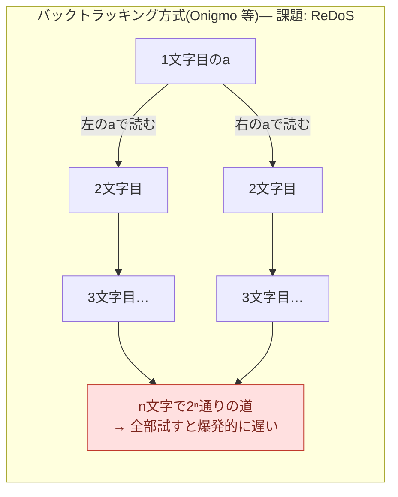

Naraku は「分岐したら、コマを増やして**全部の道に同時に**置き、1文字読むたびに全コマを
1マスずつ進める」**Pike VM** 方式を採る。同じマスに重なったコマを1つにまとめながら全道を
同時に進めるため、コマの数がプログラムサイズ(マスの数)を超えて増えず、実行時間が常に
入力長に比例する(ReDoS が構造的に起こらない)。

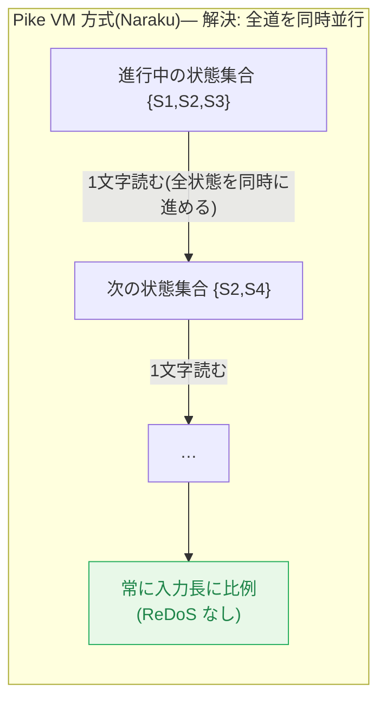

以下の施策はすべて、この「進行中の状態の集合をどう表現し、どう更新するか」という
Pike VM 実行の中核部分を、ReDoS が起きないという安全性を一切犠牲にせずに高速化したもの。
全体像は次の図の通り(各グループの先頭でも、今どの段にいるかを示す「現在地」の図を
再掲する)。

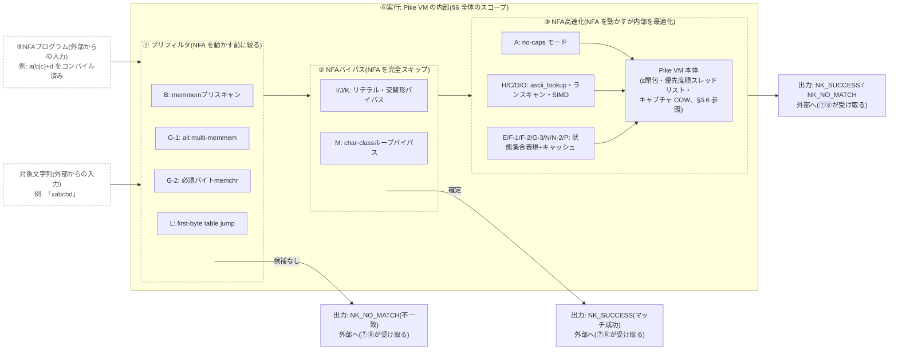

## ① プリフィルタ(NFAを動かす前に絞る)

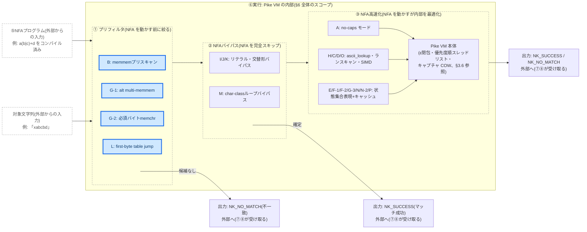

リテラル文字列が確実に含まれているか・含まれていないかを、NFA(すごろく)を1マスも
動かす前に確認できれば、見つからなかった時点で即 non-match と判定できる。B・G-1 は
「答えの候補」を探す(見つかった場合は次の②へ進み、見つからなかった場合はここで
即終了)。G-2・L は ASCII以外の手がかり(必須バイトの有無・先頭バイト集合)を使う
別系統のプリフィルタ。

### Cycle B — リテラルプレフィックス `memmem`

**目的**: NFA を1文字ずつ動かす処理(すごろくのコマを、入力文字列の先頭から1文字読むごとに
1マスずつ進める処理)は、コマがどのマスに乗っているかという状態集合の更新を伴うぶん
相応に重い。本来、「この文字列が含まれていなければ絶対にマッチしない」と事前に分かって
いるなら、コマを1マスも進めずに判定したいはず。

**課題**: 元の実装は、パターンに確定的なリテラル接頭辞(`Watson` のような固定文字列)が
あっても、毎回コマを盤面の先頭から1マスずつ律儀に動かして判定していた。

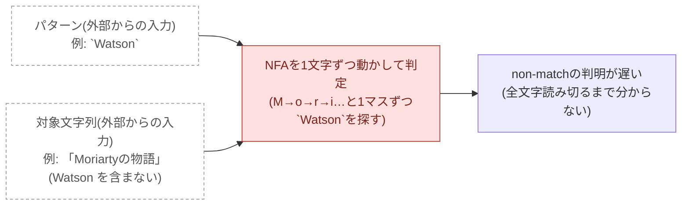

**解決**: コンパイル時にリテラル接頭辞を取り出し、実行時は **memmem**(ある文字列が別の
文字列のどこにあるかを高速に探す標準ライブラリの関数)でまず先頭位置を探す。見つからなければ
NFA を一切動かさず non-match を返す。

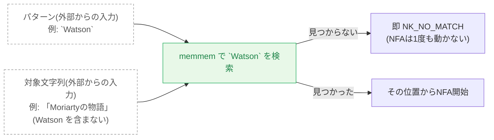

**核心コード**(`src/regex_vm.c:1335-1341`):
```c
if (program->literal_prefix_len > 0 && !program->is_anchored) {
  const uint8_t* found = vm_memmem(subject_bytes + start_offset, scan_len,
                                    program->literal_prefix_bytes, program->literal_prefix_len);
  if (found == NULL) {
    return NK_NO_MATCH;  // NFA を一切動かさない
  }
}
```

- 効果: literal / bounded の non-match で即 return
- コード: `src/regex_vm.c:27`(`vm_memmem`)、`src/regex_vm.c:1331-1341`

### Cycle G-1 — 交替形 multi-memmem

**目的**: `foo|bar|baz` のように「全部の枝がリテラル」の交替形は、各枝をすごろくの分岐
(コマが複数のマスに分かれる処理)として処理するのではなく、各枝に対応する文字列検索を
並走させて、最も左で見つかった枝がそのまま答えになるはず。

**課題**: 元の実装は交替もNFAの分岐として処理し、各枝をコマで並行に追跡していた。

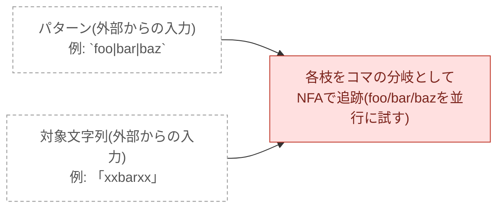

**解決**: コンパイル時に全枝がASCIIリテラルだと分かれば、実行時は各枝に `memmem` を
並走させ、入力中で最も左に見つかった枝の位置を先取りする。

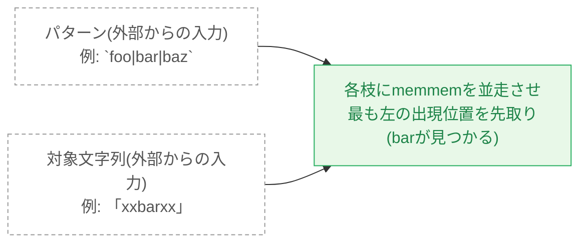

**核心コード**(`src/regex_vm.c:1365-1373`):
```c
for (size_t i = 0; i < program->alt_literal_count; i++) {
  const uint8_t* found = vm_memmem(scan_base, scan_len,
                                     program->alt_literal_bytes[i], program->alt_literal_lens[i]);
  if (found != NULL && (earliest == NULL || found < earliest)) earliest = found;  // 最も左を採用
}
if (earliest == NULL) return NK_NO_MATCH;
```

- 効果: alternation non-match で即 return
- コード: `src/regex_vm.c:1357-1374`

### Cycle G-2 — 必須バイト prefilter

**目的**: `a+b` のように「マッチが成立するなら必ず特定のASCIIバイト(この例では `b`)が
入力中に存在する」と分かっているなら、その存在を先に確認できれば、無ければNFAを動かさず
即座に non-match と判定できるはず。

**課題**: 元の実装にはそのような事前フィルタが無く、`b` が1つも無い入力でも必ずNFAを
起動して(失敗するまで)判定していた。

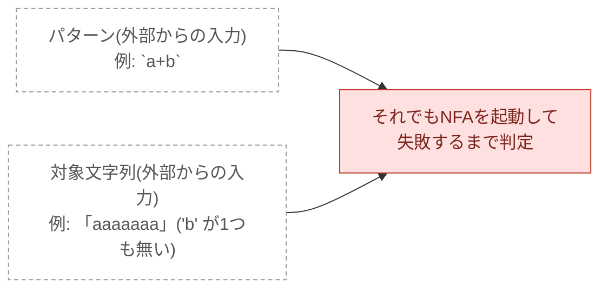

**解決**: コンパイル時に「マッチに必ず登場するASCIIバイト」を解析しておき、実行時は
**memchr**(指定したバイトが文字列のどこにあるかを高速に探す標準ライブラリの関数)で
先行確認する。

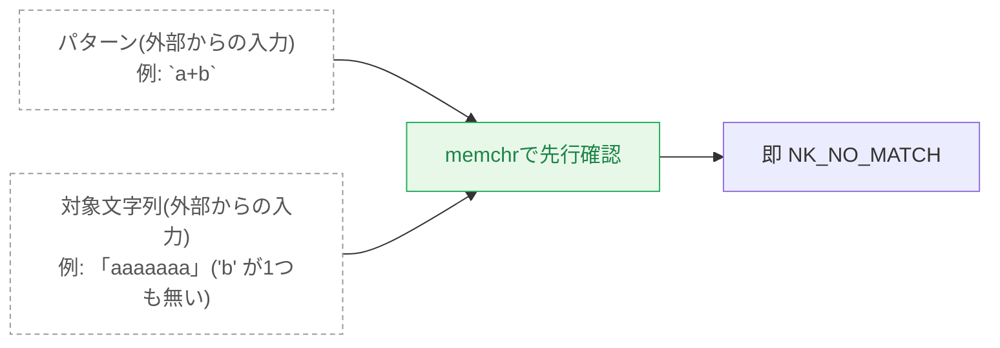

**核心コード**(`src/regex_vm.c:1324-1328`):
```c
if (program->has_required_byte) {
  if (memchr(subject_bytes + start_offset, (int)program->required_byte, scan_len) == NULL) {
    return NK_NO_MATCH;  // 必須バイトが無いので即終了
  }
}
```

- 効果: repetition non-match +33%
- コード: `src/regex_vm.c:1322-1329`

### Cycle L — first-byte table jump

**目的**: コンパイル時に「マッチが始まりうる先頭バイトの集合」は確定できるはず。
`\d{4}-\d{2}-\d{2}` のようなパターンでは、ある文字(例えば `x`)では絶対にマッチが
始まらないと分かるなら、その文字が続く区間はコマを1マスも動かさずまとめてスキップ
したいはず。

**課題**: 元の実装は非マッチの位置でも、「ここはマッチ開始候補になり得ない」と分かるまで
毎回1バイトずつコマを動かしてNFAを試行していた。

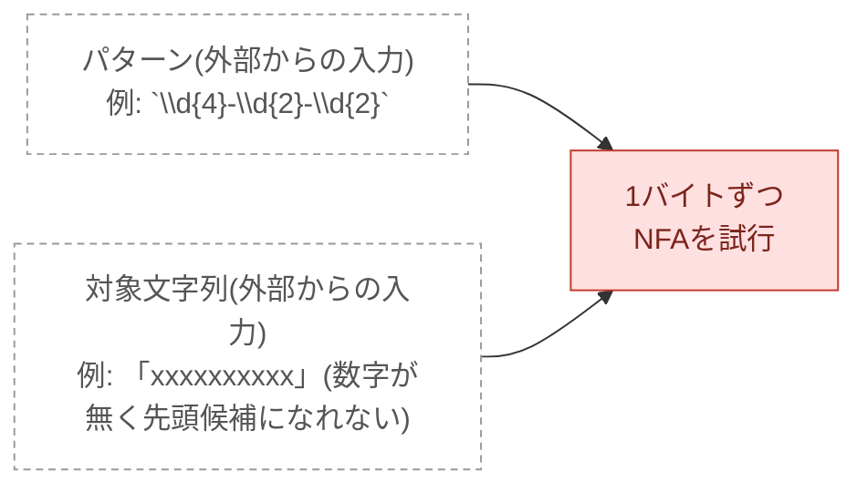

**解決**: コンパイル時に「マッチが始まりうる先頭バイト」の128エントリ表
(`first_byte_table`)を事前計算し、実行時にその表に無い文字が続く区間は一括でスキップする。

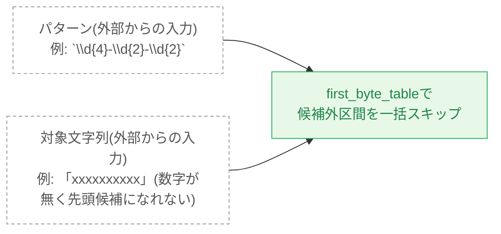

**核心コード**(`src/regex_vm.c:1107-1111`):
```c
if (!program->is_anchored && program->first_byte_table_valid &&
    curr_code < 128u && program->first_byte_table[(uint8_t)curr_code] == 0u) {
  // table に無い文字が続く間、ポインタを進めるだけでNFAを起動しない
  while (p < subject_bytes_end && program->first_byte_table[*p] == 0u) p++;
}
```

- 効果: bounded non-match で単発呼び出し ~297万 ips(batches/sec 指標では測定不可、§6.3 参照)
- コード: `src/regex_compile.c:2326`(`compute_first_byte_table`)、`src/regex_vm.c:1107-1111`

## ② NFAバイパス(NFAを完全スキップ)

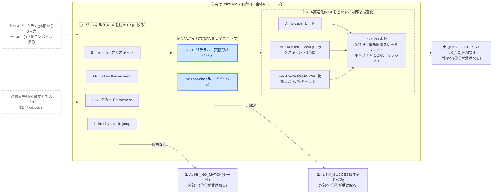

①のプリフィルタが「答えの候補」を見つけた時点で、実はもう答えが決まっている場合がある。
I・J は Cycle B・G-1 が見つけた候補をそのままマッチ結果として確定させ、NFA に確認すら
させない。K は I/J を非ASCIIに拡張したもの、M は文字クラスの繰り返しを丸ごとバイパス
するもの(手がかりがリテラル文字列ではなく文字クラスである点が異なる)。

### Cycle I — リテラル VM バイパス

**目的**: 純リテラルパターン(`Watson`)は Cycle B の `memmem` が完全に一致する位置を
見つけた時点で、もう答えは決まっている。NFA にもう一度確認させる必要はないはず。

**課題**: Cycle B は `memmem` で先頭位置を見つけたあとも、それでもNFAを起動して
リテラル全体が一致するかを律儀に再確認していた。

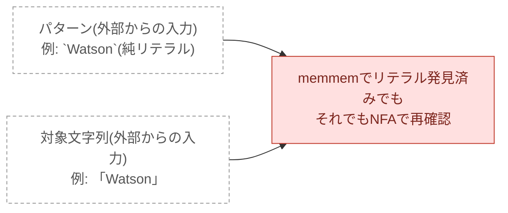

**解決**: パターンが純リテラルだとコンパイル時に分かっていれば、`memmem` が見つけた範囲を
そのままマッチ結果として返し、NFA を一切起動しない。

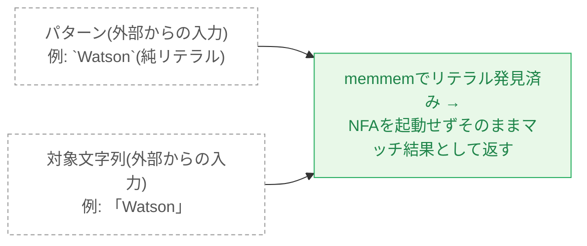

**核心コード**(`src/regex_vm.c:1344-1354`):
```c
// Pure literal bypass: memmem confirmed the complete match — skip the NFA.
if (program->is_pure_literal) {
  out_region->caps[0] = start_offset;
  out_region->caps[1] = start_offset + program->literal_prefix_len;
  return NK_SUCCESS;
}
```

- 効果: +14%(`Watson` 等の純リテラルパターン)
- コード: `src/regex_vm.c:1344-1354`

### Cycle J — 交替形 VM バイパス

**目的**: 純ASCII交替形(`foo|bar|baz`)も、Cycle G-1 の pre-scan で最も左の一致が
見つかった時点ですでに答えが出ているはずで、NFA は不要なはず。

**課題**: Cycle G-1 はあくまで「最初の絞り込み」として `memmem` を使うだけで、その後も
やはりNFAを起動して確認していた。

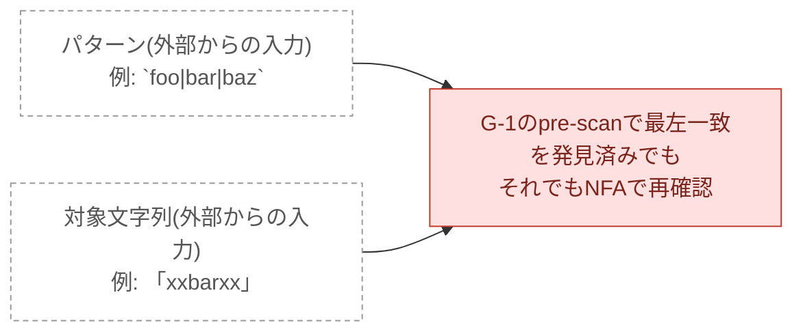

**解決**: 全ての枝が純ASCIIリテラルの交替形だとコンパイル時に分かっていれば、pre-scan の
結果をそのままマッチ結果として返す。

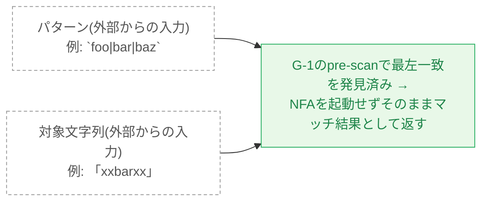

**核心コード**(`src/regex_vm.c:1376-1385`):
```c
// Pure alternation bypass: the pre-scan already confirmed a complete literal match.
if (program->is_pure_alt_literal) {
  out_region->caps[0] = start_offset;
  out_region->caps[1] = start_offset + earliest_len;
  return NK_SUCCESS;
}
```

- 効果: +25%(`foo|bar|baz` 等の純ASCII交替形)
- コード: `src/regex_vm.c:1376-1385`

### Cycle K — 非ASCII VM バイパス

**目的**: Cycle I/J のバイパスは確認のためASCIIのみが前提だったが、`ジョバンニ|カムパネルラ`
のような日本語等の非ASCIIリテラル・交替形にも同じ高速化を適用したいはず。

**課題**: 元の実装では非ASCII文字を含むリテラル・交替形はI/Jのバイパス対象外で、
必ずNFAを起動していた。

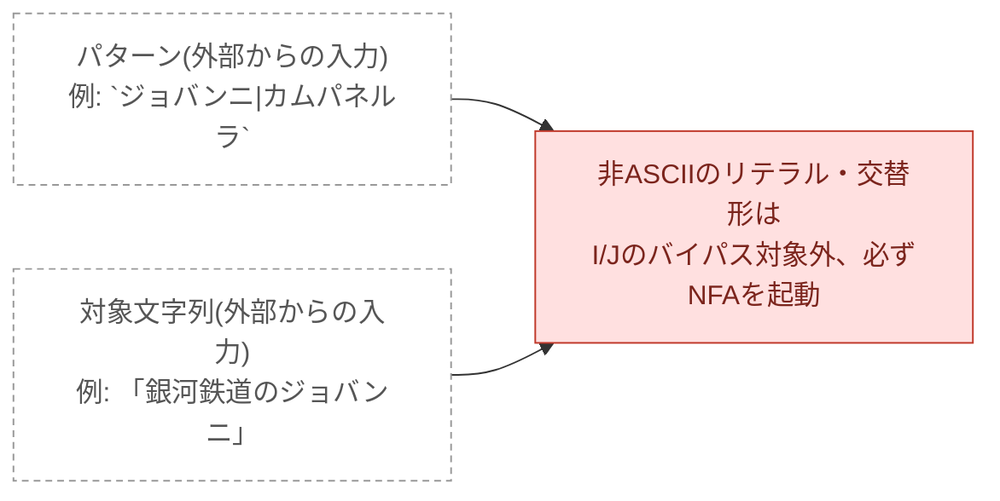

**解決**: エンコーディングを問わず、バイト列としてそのまま `memmem` 検索できるようにし、
非ASCIIのリテラル・交替形もバイパス対象に含めた。

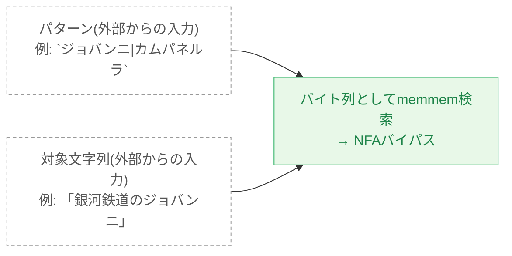

**核心コード**(`src/regex_vm.c:1388-1397`):
```c
// Non-ASCII literal/alternation bypass: encoding-agnostic memmem scan
// over the full byte sequences.
if (program->full_alt_count > 0u) {
  const uint8_t* found = vm_memmem(scan_base, scan_len,
                                     program->full_alt_bytes[i], program->full_alt_lens[i]);
}
```

- 効果: +36%(`ジョバンニ|カムパネルラ` 等)
- コード: `src/regex_vm.c:1388-1397`

### Cycle M — char-class ループバイパス

**目的**: `[a-zA-Z0-9]+` のような「文字クラスの繰り返しだけ」のパターンは、本来
「この文字集合に含まれる間は読み進める」という単純なループだけで判定できるはずで、
NFA という汎用的な仕組みをフルに使う必要はないはず。

**課題**: 元の実装はこの単純なケースでも、他の複雑なパターンと同じようにNFAの状態遷移
(ビット演算)を毎文字ごとに行っていた。

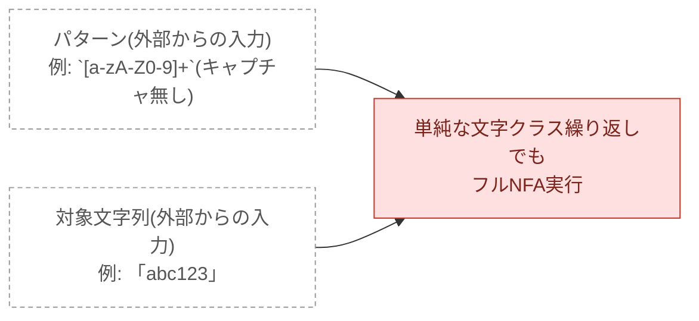

**解決**: コンパイル時に「文字クラスの繰り返しのみ・キャプチャなし」という形を検出し、
実行時は `ascii_lookup` テーブル(③ の Cycle H で作るテーブル)を直接スキャンするだけに
して NFA を完全にバイパスする。

```mermaid
flowchart LR
    Prog2["パターン(外部からの入力)\n例: `[a-zA-Z0-9]+`(キャプチャ無し)"]:::external
    Subj2["対象文字列(外部からの入力)\n例: 「abc123」"]:::external
    Prog2 --> Skip
    Subj2 --> Skip
    Skip["NFAを起動せず\nascii_lookup を直接スキャン"]:::good
    classDef good fill:#e8f8e8,stroke:#27ae60,color:#1e8449
    classDef external fill:none,stroke:#999,stroke-width:1px,stroke-dasharray: 4 3,color:#555
```

**核心コード**(`src/regex_vm.c:1411-1417`):
```c
// Pure char-class loop bypass: [X]+, \w+, \d+ etc. with no captures.
if (program->is_pure_char_class_plus) {
  const nk_vm_char_class_t* cc = &program->char_classes[program->pure_cc_index];
  while (p < subject_bytes_end && cc->ascii_lookup[*p] != 0u) p++;  // NFA不要
}
```

- 効果: char_class が Onigmo比 0.82x → 0.90x
- コード: `src/regex_vm.c:1411`、`src/regex_compile.c:2569`

## ③ NFA高速化(NFAを動かすが内部を最適化)

```mermaid
flowchart LR
    Prog["⑤NFAプログラム(外部からの入力)\n例: a(b|c)+d をコンパイル済み"]:::external
    Subj["対象文字列(外部からの入力)\n例: 「xabcbd」"]:::external
    Prog --> pre
    Subj --> pre

    subgraph vm["⑥実行: Pike VM の内部(§6 全体のスコープ)"]
        direction LR

        subgraph pre["① プリフィルタ(NFA を動かす前に絞る)"]
            direction TB
            gB["B: memmemプリスキャン"]
            gG1["G-1: alt multi-memmem"]
            gG2["G-2: 必須バイトmemchr"]
            gL["L: first-byte table jump"]
            anchor1[" "]:::invis
        end

        subgraph bypass["② NFAバイパス(NFA を完全スキップ)"]
            direction TB
            gIJK["I/J/K: リテラル・交替形バイパス"]
            gM["M: char-classループバイパス"]
            anchor2[" "]:::invis
        end

        subgraph nfa["③ NFA高速化(NFA を動かすが内部を最適化)"]
            direction LR
            base["Pike VM 本体\n(ε閉包・優先度順スレッドリスト・\nキャプチャ COW、§3.6 参照)"]:::current
            gA["A: no-caps モード"]:::current
            gHCDO["H/C/D/O: ascii_lookup・ランスキャン・SIMD"]:::current
            gEFNP["E/F-1/F-2/G-3/N/N-2/P: 状態集合表現+キャッシュ"]:::current
            gA --> base
            gHCDO --> base
            gEFNP --> base
        end

        pre --> bypass
        bypass --> nfa
    end

    anchor1 -->|"候補なし"| Result["出力: NK_NO_MATCH(不一致)\n外部へ(⑦⑧が受け取る)"]
    anchor2 -->|"確定"| Result2["出力: NK_SUCCESS(マッチ成功)\n外部へ(⑦⑧が受け取る)"]
    nfa --> Result3["出力: NK_SUCCESS / NK_NO_MATCH\n外部へ(⑦⑧が受け取る)"]

    classDef external fill:none,stroke:#999,stroke-width:1px,stroke-dasharray: 4 3,color:#555
    classDef invis fill:none,stroke:none
    classDef stageBox fill:none,stroke:#999,stroke-width:1px,stroke-dasharray: 4 3
    class pre,bypass,nfa stageBox
    classDef current fill:#cfe8ff,stroke:#1f6feb,color:#0d3a6b,stroke-width:3px
```

①②でも答えが出ない(キャプチャが必要、リテラル/文字クラス以外の構造が混じっている等)
場合、NFAを本格的に動かすしかない。このグループは3つのテーマに分かれる:
**基礎コスト**(A — 使わない処理をそもそもしない)、**ループの中身**(H・C・D・O —
同じ判定が連続するバイト列をまとめて処理する)、**状態集合の表現とキャッシュ**
(E・F-1・F-2/G-3・N・N-2・P — 「今コマがどのマスに乗っているか」自体の表現と
その遷移計算の高速化、一直線の発展になっている)。

### Cycle A — no-caps モード + `\A` アンカースキップ

**目的**: 正規表現の `(...)` で囲んだ部分は「**キャプチャグループ**」と呼ばれ、たとえば
`/a(b|c)d/` が `"abd"` にマッチしたとき、`(b|c)` の部分が文字列の「1文字目〜2文字目」に
当たった、という**位置の情報**(キャプチャ位置)を記録できる。一方 `match?` は「マッチした
かどうか」の YES/NO だけを返す API で、この位置の情報をそもそも使わない。本来、使わない
情報を計算するコストは払わなくていいはず。

**課題**: 元の実装はどの呼び出しでもキャプチャ位置を記録する配列のためにメモリ確保
(malloc)していたため、`match?` のように使わない場合でも毎回コストが発生していた。

```mermaid
flowchart LR
    Prog["パターン(外部からの入力)\n例: `a(b|c)d`"]:::external
    Subj["対象文字列(外部からの入力)\n例: 「abd」"]:::external
    Prog --> M
    Subj --> M
    M["match?(s)は真偽値だけでよいのに\ncaps配列のメモリ確保(malloc)"]:::bad --> Run["NFA 実行"]
    classDef bad fill:#ffe0e0,stroke:#c0392b,color:#7b241c
    classDef external fill:none,stroke:#999,stroke-width:1px,stroke-dasharray: 4 3,color:#555
```

**解決**: `no_caps` フラグを導入し、true のときはキャプチャ配列の確保を完全にスキップする。

```mermaid
flowchart LR
    Prog2["パターン(外部からの入力)\n例: `a(b|c)d`"]:::external
    Subj2["対象文字列(外部からの入力)\n例: 「abd」"]:::external
    Prog2 --> NC
    Subj2 --> NC
    NC["match?(s) →\nno_caps=true、メモリ確保しない"]:::good --> Run2["NFA 実行"]
    classDef good fill:#e8f8e8,stroke:#27ae60,color:#1e8449
    classDef external fill:none,stroke:#999,stroke-width:1px,stroke-dasharray: 4 3,color:#555
```

**核心コード**(`src/regex_vm.c:1523`):
```c
caps_t* caps = no_caps ? NO_CAPS_PTR : caps_new(vm.num_caps);
```

- 効果: 全パターンの基礎コスト削減(マッチ判定1回あたりの malloc がゼロに)
- コード: `src/regex_vm.c:212`(`no_caps` フラグ)、`src/regex_vm.c:1302,1523`

### Cycle H — ascii_lookup 平坦テーブル

**目的**: 文字クラス(`[a-zA-Z0-9]` 等)のASCII判定は、本来「このバイトはこの集合の
メンバーか」という単純な問い合わせのはず。

**課題**: 元の実装はこの判定をビットマスクの組み合わせ(複数のビット演算)で行っていた。
ロジック自体は正しいが、コンパイラが自動的に **SIMD命令**(CPUが1回の命令で複数バイトを
同時に処理する機能)へ変換(自動ベクタライズ)するには複雑すぎるパターンだった。

```mermaid
flowchart LR
    Prog["パターン(外部からの入力)\n例: `[a-zA-Z0-9]+`"]:::external
    Subj["対象文字列(外部からの入力)\n例: 「abc123」"]:::external
    Prog --> Bitmap
    Subj --> Bitmap
    Bitmap["1バイトずつビット演算の組み合わせで\nASCII判定"]:::bad --> NoVec["コンパイラの自動ベクタライズが\n効きにくい"]
    classDef bad fill:#ffe0e0,stroke:#c0392b,color:#7b241c
    classDef external fill:none,stroke:#999,stroke-width:1px,stroke-dasharray: 4 3,color:#555
```

**解決**: 判定結果を **ascii_lookup**(「このバイトはこの文字集合に入っているか」を表す
256個のON/OFF表)という単純な配列に事前計算しておき、実行時は配列の1ロードだけで判定する。
ループが単純になった分、コンパイラの自動ベクタライズが効きやすくなった。

```mermaid
flowchart LR
    Prog2["パターン(外部からの入力)\n例: `[a-zA-Z0-9]+`"]:::external
    Subj2["対象文字列(外部からの入力)\n例: 「abc123」"]:::external
    Prog2 --> Table
    Subj2 --> Table
    Table["256要素の単純な配列\n(ascii_lookup)"]:::good --> Vec["1ロードで判定\n→ 自動ベクタライズが効く"]
    classDef good fill:#e8f8e8,stroke:#27ae60,color:#1e8449
    classDef external fill:none,stroke:#999,stroke-width:1px,stroke-dasharray: 4 3,color:#555
```

**核心コード**(`include/naraku_regex.h:112` + `src/regex_vm.c:360`):
```c
uint8_t ascii_lookup[256];  // [b] != 0 なら byte b はこの文字集合のメンバー
...
return char_class->ascii_lookup[code] != 0u;  // ビット演算ではなく配列の1ロード
```

- 効果: char_class スキャン全般で定数倍の高速化
- コード: `src/regex_vm.c:360`、`src/regex_vm.c:1418`

### Cycle C — CHAR_CLASS ランスキャン

**目的**: `[a-zA-Z0-9]+` のように文字クラスの繰り返しでアクティブなコマが1個だけのとき、
コマが同じ「ループの先頭マス」に留まり続けるなら、マッチする文字が続く限り1文字ずつでは
なくまとめて読み進めたいはず。

**課題**: 元の実装はコマが1個だけでも、文字クラスにマッチする間は律儀に1文字ずつ
NFA遷移(εクロージャの再計算込み)を行っていた。

```mermaid
flowchart LR
    Prog["パターン(外部からの入力)\n例: `[a-zA-Z0-9]+`"]:::external
    Subj["対象文字列(外部からの入力)\n例: 「abc123」"]:::external
    Prog --> Each
    Subj --> Each
    Each["コマが1個だけループの先頭マスに留まっても\n1文字ごとにεクロージャを再計算"]:::bad
    classDef bad fill:#ffe0e0,stroke:#c0392b,color:#7b241c
    classDef external fill:none,stroke:#999,stroke-width:1px,stroke-dasharray: 4 3,color:#555
```

**解決**: アクティブなコマが1個・かつそのマスが文字クラスのループ先頭であるときだけ、
`ascii_lookup`(Cycle H のテーブル)を使って適合する連続バイトをまとめてスキャンする。

```mermaid
flowchart LR
    Prog2["パターン(外部からの入力)\n例: `[a-zA-Z0-9]+`"]:::external
    Subj2["対象文字列(外部からの入力)\n例: 「abc123」"]:::external
    Prog2 --> Run
    Subj2 --> Run
    Run["コマが1個だけループの先頭マスに留まるなら\nascii_lookupで連続する適合バイトを一括スキャン"]:::good
    classDef good fill:#e8f8e8,stroke:#27ae60,color:#1e8449
    classDef external fill:none,stroke:#999,stroke-width:1px,stroke-dasharray: 4 3,color:#555
```

**核心コード**(`src/regex_vm.c:1561-1577`):
```c
if (scan_state->op == NK_VM_OP_CHAR_CLASS) {
  const nk_vm_char_class_t* cc = &program->char_classes[scan_state->char_class_index];
  if (cc->ascii_lookup[curr_code] != 0u && /* ループ先頭か確認 */ cc_can_scan) {
    scan = pos + 1 + ascii_class_run_length(cc, subject_bytes + pos + 1, subject_len - pos - 1);
  }
}
```

- 効果: `[a-zA-Z0-9]+` +148%
- コード: `src/regex_vm.c:1549-1579`(`ascii_class_run_length` 呼び出し)

### Cycle D — CODE ランスキャン

**目的**: `a+b` のように固定の1バイト文字(リテラル文字1個)の繰り返しでも、Cycle C と
同じ理由でまとめて読み進めたいはず。

**課題**: Cycle C のランスキャンは文字クラス専用で、固定バイト(`NK_VM_OP_CODE`)の
繰り返しである `a+` のようなパターンには適用されておらず、1文字ずつ処理されていた。

```mermaid
flowchart LR
    Prog["パターン(外部からの入力)\n例: `a+b`"]:::external
    Subj["対象文字列(外部からの入力)\n例: 「aaaaaaab」"]:::external
    Prog --> Each2
    Subj --> Each2
    Each2["a+ のような固定バイトのループの先頭マスでも\n1文字ごとにNFA遷移"]:::bad
    classDef bad fill:#ffe0e0,stroke:#c0392b,color:#7b241c
    classDef external fill:none,stroke:#999,stroke-width:1px,stroke-dasharray: 4 3,color:#555
```

**解決**: コマが1個・そのマスが固定バイト(CODE)・かつ次のマスがε遷移(ループ先頭である
証拠)であることを確認し、同じバイトが続く限りまとめて読み進める。

```mermaid
flowchart LR
    Prog2["パターン(外部からの入力)\n例: `a+b`"]:::external
    Subj2["対象文字列(外部からの入力)\n例: 「aaaaaaab」"]:::external
    Prog2 --> Run2
    Subj2 --> Run2
    Run2["a+ のような固定バイトのループの先頭マスなら\n同じバイトの連続区間を一括スキャン"]:::good
    classDef good fill:#e8f8e8,stroke:#27ae60,color:#1e8449
    classDef external fill:none,stroke:#999,stroke-width:1px,stroke-dasharray: 4 3,color:#555
```

**核心コード**(`src/regex_vm.c:1580-1589`):
```c
} else if (scan_state->op == NK_VM_OP_CODE && state_matches_code(program, scan_state, curr_code)) {
  // 次のマスがε遷移(ループ先頭)であることを確認した上でのみスキャン
  if (/* next_op がループ先頭の証拠 */ true) {
    scan = pos + 1;  // ここから同じバイトが続く限りまとめて読み進める
  }
}
```

- 効果: `a+b` +392%
- コード: `src/regex_vm.c:1580-1606`

### Cycle O — ASCII ランスキャンの SIMD 化

**目的**: Cycle H のテーブル化で文字クラス判定は単純な配列ロードになったが、本来
「同じ判定を連続するバイト列に対して繰り返す」処理はCPUのSIMD命令(1回の命令で複数バイトを
同時処理する仕組み)でまとめて行えるはず。

**課題**: Cycle H はコンパイラの自動ベクタライズに依存していたため、確実に効くかは
コンパイラやビルドオプション(`-march=native` 等)次第で、長い入力でも狭いASCII範囲の
チェックを1バイトずつ行っているのと変わらないことがあった。

```mermaid
flowchart LR
    Prog["パターン(外部からの入力)\n例: `[a-zA-Z0-9]+`"]:::external
    Subj["対象文字列(外部からの入力)\n例: 「aB3」×2000(6000バイトの長い入力)"]:::external
    Prog --> Auto
    Subj --> Auto
    Auto["自動ベクタライズ依存"]:::bad --> Uncertain["-march=native必須\n確実に効くとは限らない"]
    classDef bad fill:#ffe0e0,stroke:#c0392b,color:#7b241c
    classDef external fill:none,stroke:#999,stroke-width:1px,stroke-dasharray: 4 3,color:#555
```

**解決**: 文字クラスのASCIIメンバーを最大4本の連続バイト範囲に分解しておき、SSE2の
組み込み関数(`_mm_min_epu8`/`_mm_max_epu8`)で明示的に16バイトずつ範囲判定する。
範囲数が4を超える複雑なクラスは、常に正しい既存のスカラー(1バイトずつの)経路に
フォールバックする。

```mermaid
flowchart LR
    Prog2["パターン(外部からの入力)\n例: `[a-zA-Z0-9]+`"]:::external
    Subj2["対象文字列(外部からの入力)\n例: 「aB3」×2000(6000バイトの長い入力)"]:::external
    Prog2 --> SSE
    Subj2 --> SSE
    SSE["SSE2の明示的SIMD命令\n(_mm_min_epu8/_mm_max_epu8)"]:::good --> Run["16バイト/回で範囲判定"]
    classDef good fill:#e8f8e8,stroke:#27ae60,color:#1e8449
    classDef external fill:none,stroke:#999,stroke-width:1px,stroke-dasharray: 4 3,color:#555
```

**核心コード**(`src/regex_vm.c:58-66`):
```c
__m128i bytes = _mm_loadu_si128((const __m128i*)(p + i));  // 16バイト一括ロード
for (uint8_t r = 0; r < range_count; r++) {
  __m128i clamped = _mm_max_epu8(_mm_min_epu8(bytes, hi_v), lo_v);  // 範囲内か16バイト同時判定
}
```

- 効果: 長い入力(6000バイト)の単発呼び出しで Onigmo+YJIT 比 約95〜100倍
- コード: `src/regex_vm.c:58`(`simd_ascii_range_run`)、`:99`(`ascii_class_run_length`)

### Cycle E — Thompson NFA bitset

**目的**: Pike VM は「今すごろくのどのマスにコマが乗っているか」(状態の集合)をすべて
管理する必要がある。この情報は本来「このマスにコマが乗っているか、乗っていないか」という
1ビット(ON/OFF)の集まりに過ぎないので、固定長の単純なデータで表現できるはず。

**課題**: 元の実装は「コマが乗っているマス」を**スレッドリスト**(今どのマスにコマが
乗っているかを保持する、サイズが伸び縮みする配列)で管理していた。1文字進めるたびに
この配列を確保・走査し、複数のコマが同じマスに重なっていないか除去する処理が必要で、
分岐が多いパターン(`(a|a)+b` のような、コマが増えやすいパターン)ほどこのオーバーヘッドが
大きくなっていた。

```mermaid
flowchart LR
    Prog["パターン(外部からの入力)\n例: `(a|a)+b`(ambiguous)"]:::external
    Subj["対象文字列(外部からの入力)\n例: 「aaaaaaab」"]:::external
    Prog --> TL
    Subj --> TL
    TL["スレッドリスト\n(可変長配列、毎文字で確保・走査)"]:::bad --> Alloc["状態の重複除去も必要"]
    classDef bad fill:#ffe0e0,stroke:#c0392b,color:#7b241c
    classDef external fill:none,stroke:#999,stroke-width:1px,stroke-dasharray: 4 3,color:#555
```

**解決**: マスの数(状態数)が63以下のプログラムに限り、「コマが乗っているマスの集合」を
**ビットマスク**(0/1の並びだけで「どのマスにコマが乗っているか」を表す方法。1個の整数に
多数のON/OFFを詰め込める)で表現する。マス1つにつきビット1つが対応し、1文字読んでコマを
進める処理は「ビット単位の OR 演算1回」に圧縮される。配列の確保・走査・重複除去がすべて
不要になる。

```mermaid
flowchart LR
    Prog2["パターン(外部からの入力)\n例: `(a|a)+b`(ambiguous)"]:::external
    Subj2["対象文字列(外部からの入力)\n例: 「aaaaaaab」"]:::external
    Prog2 --> BS
    Subj2 --> BS
    BS["uint64_t 1本のビットマスク\n(状態の有無を1ビットで表現)"]:::good --> OR["状態遷移 = OR演算1回"]
    classDef good fill:#e8f8e8,stroke:#27ae60,color:#1e8449
    classDef external fill:none,stroke:#999,stroke-width:1px,stroke-dasharray: 4 3,color:#555
```

**核心コード**(`src/regex_vm.c:944-952`):
```c
static nk_bitset128_t bitset_transition(const nk_program_t* program, nk_bitset128_t active, uint32_t curr_code) {
  nk_bitset128_t next = NK_BITSET128_ZERO;
  // active の立っているビット(=コマが乗っているマス)だけを走査し、
  // 遷移先のマスをまとめて OR で next に書き込む
  ...
}
```

- 効果: ambiguous +983%(≤63状態の全パターンに適用)
- コード: `src/regex_vm.c:944`(`bitset_transition`)、`src/regex_vm.c:1077`(`search_impl_bitset`)

### Cycle F-1 — Lazy DFA(Ruby プロトタイプ)

**目的**: 「今コマが乗っているマスの集合が、この文字を読むとどう変わるか」という計算結果は
キャッシュして再利用したい(詳細は次の Cycle F-2 参照)。Naraku は C で実行エンジンを
いきなり書く前に、まず Ruby プロトタイプ(`ruby-prototype/`)で設計を固める方針を取って
いるため、この発想もまず Ruby 側で実証された。

**課題**: Ruby プロトタイプの `NarakuRuby::DFA` も当初は、同じ「状態集合×文字」の組み合わせに
何度も遭遇するたびゼロから計算し直していた。

**解決**: `@lazy_dfa_transitions` というハッシュに「状態集合キー → {文字 → 次の状態集合
キー}」をキャッシュする仕組みを Ruby で先に実装し、正しさを確認した上で C 実装(Cycle F-2)
に移植した。

**核心コード**(`ruby-prototype/lib/naraku_ruby/dfa/program.rb:176-181`):
```ruby
# Lazy DFA cache: memoises (NFA-state-set, char) -> next-NFA-state-set.
unless @has_assertion || full_dfa
  @lazy_dfa_transitions = {}  # state_set_key => {char_code => next_key}
  @lazy_dfa_state_sets  = {}  # state_set_key => Array<State>(逆引き用)
end
```

- 効果: assertion-free 全パターンで YJIT 有効時 +100%
- コード: `ruby-prototype/lib/naraku_ruby/dfa/program.rb:153-183`

#### Cycle G-4 — YJIT 計測(コード変更なし)

Cycle F-1 の Lazy DFA(Ruby)を YJIT 有効で実測し、`ambiguous`(`(a|a)+b`)で
Onigmo+YJIT を **1.40x** 上回ることを確認した検証マイルストーン。コード変更はなく、
計測のみで「この設計方針(ハッシュキャッシュ)が正しい方向か」を確かめた回。

### Cycle F-2 / G-3 — Lazy DFA キャッシュ(C実装)+ 拡大

**目的**: 「今コマが乗っているマスの集合(状態集合)が、この文字を読むとどのマスの集合に
変わるか」という計算は、本来「(今のマスの集合, 読んだ文字)」という入力だけで結果が決まる
純粋な計算のはず。同じ組み合わせに何度も遭遇するなら(ループのあるパターンでは頻繁に
起こる)、本来は1回計算すればそれ以降は再利用できていいはず。

**課題**: Cycle E のビット演算は1回あたりは軽いが、ループのあるパターンでは同じ
「(状態集合, 文字)」の組に何度も遭遇し、そのたびにフルのビット演算をゼロから
やり直していた。

```mermaid
flowchart LR
    Prog["パターン(外部からの入力)\n例: `(a|a)+b`(ambiguous)"]:::external
    Subj["対象文字列(外部からの入力)\n例: 「aaaaaaab」"]:::external
    Prog --> Same
    Subj --> Same
    Same["ループのあるパターンで\n同じ(状態集合,バイト)に何度も遭遇"]:::bad --> Recalc["毎回ゼロから\nビット演算を再計算"]
    classDef bad fill:#ffe0e0,stroke:#c0392b,color:#7b241c
    classDef external fill:none,stroke:#999,stroke-width:1px,stroke-dasharray: 4 3,color:#555
```

**解決**: 「(状態集合, バイト) → 次の状態集合」の計算結果を**キャッシュ**(一度計算した
結果を保存しておき、同じ問い合わせが来たら再計算せず使う仕組み。保存済み = hit、無い =
miss)に保存し、同じ組み合わせの再計算をなくす。後にキャッシュのスロット数を 256→1024 に
拡大してヒット率をさらに向上させた(G-3)。

```mermaid
flowchart LR
    Prog2["パターン(外部からの入力)\n例: `(a|a)+b`(ambiguous)"]:::external
    Subj2["対象文字列(外部からの入力)\n例: 「aaaaaaab」"]:::external
    Prog2 --> Bits
    Subj2 --> Bits
    Bits["(状態集合,バイト)"] --> Cache{"キャッシュに\n保存済み(hit)?"}:::good
    Cache -->|"hit"| O1["O(1)で結果を返す"]
    Cache -->|"miss"| Calc["計算して保存\n(256→1024スロットに拡大)"]
    classDef good fill:#e8f8e8,stroke:#27ae60,color:#1e8449
    classDef external fill:none,stroke:#999,stroke-width:1px,stroke-dasharray: 4 3,color:#555
```

**核心コード**(`src/regex_vm.c:1030-1037`):
```c
static nk_bitset128_t bitset_transition_cached(const nk_program_t* program, nk_bitset128_t active, uint32_t curr_code) {
  if (curr_code >= 128u) return bitset_transition(program, active, curr_code);
  // ハッシュ計算 -> スロットを探索 -> hit なら保存済みの next を返す、
  // miss なら bitset_transition() で計算してから保存
}
```

- 効果: ambiguous +154%(F-2)、さらに `(a|a)+b` で +37%(G-3)
- コード: `src/regex_vm.c:1030`(`bitset_transition_cached`)

### Cycle N — Thompson NFA bitset 128 状態化

**目的**: Cycle E のビットマスク方式は速いが、本来はすごろくの盤面のマス数(状態数)に
関わらずすべてのパターンに同じ恩恵が及んでほしい。

**課題**: ビットマスクに使っていた整数(uint64_t)は64ビットしかないため、1個のビットに
1マスを対応させる Cycle E の方式は盤面のマス数が63以下のプログラムにしか適用できなかった。
`(?:a?){30}a{30}` のような64マスを超える盤面になるパターン(pathological)は遅い汎用
スレッドリスト方式にフォールバックするしかなく、Cycle E〜H の恩恵を一切受けられず
Onigmo比 0.01x という大きな弱点になっていた。

```mermaid
flowchart LR
    Prog["パターン(外部からの入力)\n例: `(?:a?){30}a{30}`(pathological、64状態超)"]:::external
    Subj["対象文字列(外部からの入力)\n例: 「aaa...a」(30個のa)"]:::external
    Prog --> Fallback
    Subj --> Fallback
    Fallback["64状態超のパターンは\n遅い汎用スレッドリストにフォールバック"]:::bad --> Bad01["Onigmo比 0.01x"]
    classDef bad fill:#ffe0e0,stroke:#c0392b,color:#7b241c
    classDef external fill:none,stroke:#999,stroke-width:1px,stroke-dasharray: 4 3,color:#555
```

**解決**: 128ビット整数(`__uint128_t`、GCC/Clang拡張)は `-std=c99 -Wpedantic` で
使えないため、`{uint64_t lo, hi;}` という2語構造体を自作してビットマスクを128bitに
拡張し、Cycle E の手法を64〜127状態のパターンにも適用できるようにした。

```mermaid
flowchart LR
    Prog2["パターン(外部からの入力)\n例: `(?:a?){30}a{30}`(pathological、64状態超)"]:::external
    Subj2["対象文字列(外部からの入力)\n例: 「aaa...a」(30個のa)"]:::external
    Prog2 --> U64
    Subj2 --> U64
    U64["64bit整数1本\n(63状態まで)"] -->|"拡張"| B128["{lo,hi}の2語構造体\n(127状態まで)"]:::good
    classDef good fill:#e8f8e8,stroke:#27ae60,color:#1e8449
    classDef external fill:none,stroke:#999,stroke-width:1px,stroke-dasharray: 4 3,color:#555
```

**核心コード**(`include/naraku_regex.h:125-128`):
```c
typedef struct {
  uint64_t lo;  // 状態 0-63
  uint64_t hi;  // 状態 64-127
} nk_bitset128_t;
```

- 効果: pathological が 10 ips → 793 ips(mruby、約79倍)
- コード: `include/naraku_regex.h:125-128`(`nk_bitset128_t`)

### Cycle N-2 — Lazy DFA キャッシュの narrow/wide 2経路化

**目的**: キャッシュは本来「使えば速くなる、使わなくても遅くならない」追加機能であるはず。
新しいパターンを救うための拡張が、既存の速いケースを遅くしてしまうのは本来あるべき姿ではない。

**課題**: Cycle N でビットマスクを64→128ビットに広げた結果、キャッシュの1スロットも
24→40バイトに肥大化した。キャッシュ全体(1024スロット)では24KB→40KBとなり、典型的な
CPUの **L1dキャッシュ**(CPU内部にある、メインメモリより圧倒的に速いが容量が小さい記憶
領域、32KB程度)に収まらなくなった。結果、Cycle N が直接救おうとした64状態超のパターン
以外の、もともと速かった ≤63状態のパターン(ambiguous・bounded・repetition)まで意図せず
後退してしまった。

```mermaid
flowchart LR
    Prog["パターン(外部からの入力)\n例: `(a|a)+b`(ambiguous、≤63状態)"]:::external
    Subj["対象文字列(外部からの入力)\n例: 「aaaaaaab」"]:::external
    Prog --> Slot
    Subj --> Slot
    Slot["キャッシュ1スロットが\n24→40バイトに肥大化"]:::bad --> L1d["1024スロット合計\n24KB→40KB、L1d(32KB)に収まらない"] --> Regress["≤63状態の既存パターンが後退"]
    classDef bad fill:#ffe0e0,stroke:#c0392b,color:#7b241c
    classDef external fill:none,stroke:#999,stroke-width:1px,stroke-dasharray: 4 3,color:#555
```

**解決**: ビットマスク自体(128bit)は変えず、**キャッシュの保存形式だけ**を状態数で
2種類に分ける。状態数が63以下のプログラムは元の24バイトスロット(narrow)を使い、
64〜127状態のプログラムだけ40バイトスロット(wide)を使う。

```mermaid
flowchart LR
    Prog2["パターン(外部からの入力)\n例: `(a|a)+b`(ambiguous、≤63状態)"]:::external
    Subj2["対象文字列(外部からの入力)\n例: 「aaaaaaab」"]:::external
    Prog2 --> Sz
    Subj2 --> Sz
    Sz["状態数 ≤63?"] -->|"yes"| Narrow["24バイトスロット\n(L1dに収まる)"]:::good
    Sz -->|"no"| Wide["40バイトスロット\n(127状態まで対応)"]:::good
    classDef good fill:#e8f8e8,stroke:#27ae60,color:#1e8449
    classDef external fill:none,stroke:#999,stroke-width:1px,stroke-dasharray: 4 3,color:#555
```

**核心コード**(`src/regex_vm.c:1035-1037`):
```c
if (program->lazy_dfa_narrow != NULL) {
  return bitset_transition_cached_narrow(program, active, curr_code);  // 24バイトスロット経路
}
// それ以外は40バイトスロット(wide)経路へ
```

- 効果: ambiguous 1.11x→1.25x、bounded 1.09x→1.14x、repetition 0.45x→0.55x(CExt/Ong)
- コード: `include/naraku_regex.h:206-212`(narrow スロット)、`:243-246`(narrow キャッシュ)

### Cycle P — 固定点検出による単一バイトランスキャン

**目的**: Cycle F-2/G-3 のキャッシュは「同じ(状態集合, バイト)の組み合わせ」を
再計算しないためのものだが、本来「同じ文字が連続する区間」では、もっと根本的に
「状態集合自体が変わらない」と分かるはずで、キャッシュへの問い合わせすら不要になっていい。

**課題**: `a+b` のような単純な繰り返しパターンでも、毎バイトごとにキャッシュへの問い合わせ
(ハッシュ計算・比較)というオーバーヘッドが発生し続けていた。

```mermaid
flowchart LR
    Prog["パターン(外部からの入力)\n例: `a+b`"]:::external
    Subj["対象文字列(外部からの入力)\n例: 「aaaaaaab」"]:::external
    Prog --> Lookup
    Subj --> Lookup
    Lookup["a+b等の繰り返しパターンでも\n毎バイト: キャッシュに問い合わせ"]:::bad --> Overhead["ハッシュ計算のオーバーヘッド"]
    classDef bad fill:#ffe0e0,stroke:#c0392b,color:#7b241c
    classDef external fill:none,stroke:#999,stroke-width:1px,stroke-dasharray: 4 3,color:#555
```

**失敗した試み**: 「キャッシュに問い合わせる前に」同じ判定を先取りしようとする実装を
一度試したが、これはキャッシュ本来のO(1)の速さを打ち消す重複処理になり、他の多くの
パターン(ambiguous・bounded・pathological)を後退させてしまったため revert した。

```mermaid
flowchart LR
    Try["失敗した試み:\nキャッシュに問い合わせる前に"] --> Scan0["ビットスキャンで先取り判定"]:::bad2 --> Regress2["他カテゴリが広範囲に後退\n(revert済み)"]
    classDef bad2 fill:#fff3cd,stroke:#b8860b,color:#5c4400
```

**解決**: 発想を変え、**キャッシュに問い合わせた後に**、既に計算済みの「1文字読んだ後の
マスの集合」`next` を再利用する。`next` が「読む前のマスの集合」`active` と完全に同じ
(**固定点**: これ以上変化しない状態のこと。同じ文字を読んでもコマの乗り方が一切変わらない
ということ)であれば、「同じバイトを何回読んでもコマの乗り方は変わらない」ことが数学的に
保証されるので、その場でバイト列をキャッシュを介さず直接スキャンする。追加コストは
struct比較2回のみ。

```mermaid
flowchart LR
    Prog2["パターン(外部からの入力)\n例: `a+b`"]:::external
    Subj2["対象文字列(外部からの入力)\n例: 「aaaaaaab」"]:::external
    Prog2 --> Next
    Subj2 --> Next
    Next["キャッシュに問い合わせた後の next"] --> Eq{"next == active?\n(固定点か)"}:::good
    Eq -->|"yes"| Scan["キャッシュ無しで\n直接バイト列をスキャン"]
    Eq -->|"no"| Cont["通常の1バイト遷移を継続"]
    classDef good fill:#e8f8e8,stroke:#27ae60,color:#1e8449
    classDef external fill:none,stroke:#999,stroke-width:1px,stroke-dasharray: 4 3,color:#555
```

**核心コード**(`src/regex_vm.c:1144-1150`):
```c
nk_bitset128_t next = bitset_transition_cached(program, active, curr_code);  // キャッシュ参照「後」
if (curr_code < 128u && nk_bitset128_eq(next, active)) {  // struct比較2回だけ
  while (scan < subject_len && subject_bytes[scan] == run_byte) scan++;  // キャッシュ無しで直接スキャン
}
```

- 効果: repetition 0.55x→2.90x、ambiguous 1.27x→7.80x(CExt/Ong)。全10カテゴリで Onigmo 超え達成
- コード: `src/regex_vm.c:1144`(`nk_bitset128_eq(next, active)`)
