# Naraku Regex VM 設計ドキュメント

Naraku(奈落)の正規表現 VM(コンパイラ + 実行器)の設計ドキュメント。
mruby 上で実際にマッチングが動く最小実装の確定済み設計と、その根拠を記録する。

> **記録基点**: 本文書は **2026-06-20 時点**の実装を記録する。行数・テスト数は随時
> 変わるため、最新値は `wc -l` / `bundle exec rake naraku:test_mruby` で確認すること。

- **対象読者**: このプロジェクトの開発者・レビュアー。
  正規表現エンジンの内部構造を知らない読者でも読み進められるよう、
  §3 で基礎から実装まで順を追って説明する。
- **関連資料**: 機能仕様は `docs/ja/spec.md`、C 実装の設計原本は
  `ruby-prototype/lib/naraku_ruby/dfa/`(Ruby プロトタイプ)。
  挙動の疑問が出たらまずプロトタイプを参照すること。

---

## 1. このドキュメントの読み方

| 知りたいこと | 読む場所 |
|---|---|
| 全体の地図・実装ステータス・リポジトリ構成 | §1.1〜1.2 |
| なぜこの設計なのか(妥当性の根拠) | §2 |
| 正規表現エンジンの仕組みをゼロから / VM の実装詳細(実装再開・レビュー用) | §3 |
| mruby からどう使えるか / 機能別ハンズオン | §4 |
| Onigmo と何が違うのか(機能比較・できないこと) | §5 |
| 性能改善の手法・Onigmo との実測比較 | §6(理論比較は §5.4) |


### 1.1 コンポーネント構成

**実装状況(`d1a6be9` 前後)**

- `d1a6be9` 時点: Naraku は**パーサー専用エンジン**(①〜③のみ)。
  `Naraku::Parser.new(enc, pattern).parse` で AST は得られたが、その先で
  マッチングを行う手段がなかった
- ただし `d1a6be9` 時点には Ruby プロトタイプも既に存在
  (`ruby-prototype/lib/naraku_ruby/dfa/compiler.rb` が④VMコンパイラ、
  `program.rb` が⑥Pike VM実行器の設計原本)
  - makenowjust 氏の RubyKaigi 2026 講演スライド74「Next plan for Project
    Naraku」(`parse.c`(C) → `comp.rb`(Ruby) → `exec.c`(C) という段階的プラン)の
    `comp.rb` に相当する段階
  - `exec.c` 部分も Naraku では先に Ruby で `program.rb` として試作済み
    (スライドの提案より手厚い)
- `d1a6be9` 以降: この Ruby プロトタイプを設計原本に④〜⑧(VM コンパイラ・
  Pike VM 実行器・mruby マッチ API・CRuby ネイティブ拡張)を C で新規実装し、
  全コンポーネントが完成済み(🟩)

**開発支援・ツールの時系列**(実行時データフロー①〜⑧の外側)

- Unicode コード生成(`tools/gen_*.rb`): `d1a6be9` から存在
- 対話型テスター・4 エンジン比較ベンチマーク・ビルド・テストパイプライン
  (CI = `.github/workflows/ci.yml`): **いずれも `d1a6be9` 以降に新規追加**

下図は §1.2 の地図に実装の時系列を色付けしたもの。

**下図の見方**

- ノードの色(グレー/緑) = `d1a6be9` 以前/以降
- 3つの囲み(対象とする範囲):
  - グレー点線(外枠): **ビルド・テストパイプライン**の対象(①〜⑧全体)
  - 青点線: **対話型テスター**の対象(①〜⑦、⑧は対象外)
  - 紫の実線(⑥実行・⑧CRuby拡張): **4エンジン比較ベンチマーク**の対象
    (Onigmo[CRuby標準組み込みの既存エンジン、Naraku外]・Rubyプロトタイプ
    [`NarakuRuby::DFA` = 図の④⑥の設計原本である `compiler.rb`+`program.rb` を
    Ruby のまま動かしたもの]とも比較するため、この2ノードだけでは比較の
    全体像ではない)
- 2本の点線矢印(Rubyプロトタイプ→④、Rubyプロトタイプ→⑥): スライド74の
  `comp.rb`/`exec.c` → C 完全移植にあたる進捗
- 「Dev Container 環境構築」の箱: ①〜⑧が動く前提条件
  (`d1a6be9` 時点には無かった、表は本節末尾参照)

```mermaid
%%{init: {"flowchart": {"nodeSpacing": 4, "rankSpacing": 8}}}%%
flowchart LR
    subgraph outerScope["Dev Container(`devcontainer.json`: ベースイメージ + setup.sh、①〜⑧が動く前提条件)"]
        direction LR
        subgraph linuxScope["コンテナベースイメージ: Ubuntu 24.04(ホスト OS は無関係)"]
        direction LR
        subgraph patG[" "]
            direction TB
            Pat["パターン文字列"]
            PatEx["例: (?&lt;hour&gt;\d{2}):(?'minute'\d{2})"]:::ex
        end

        subgraph subjG[" "]
            direction TB
            Subj["対象文字列"]
            SubjEx["例: 14:30"]:::ex
        end
        subgraph devEnvG[" "]
            direction TB
            DevEnv["setup.sh による環境構築"]:::newimpl
            DevEnvEx["例: rbenv・Ruby・mruby submodule・\nビルドを順に実行"]:::ex
        end

        subgraph pipelineScope["①〜⑧(ビルド・テストパイプラインの対象)"]
        direction LR
        subgraph toolScope["①〜⑦(対話型テスターがE2Eで試す範囲)"]
            direction LR
            subgraph compile["コンパイル(1回だけ)"]
                direction LR
                subgraph parserG[" "]
                    direction TB
                    Parser["①パーサー"]:::pre
                    ParserEx["例: トークン列に分解"]:::ex
                end
                subgraph astG[" "]
                    direction TB
                    AST["②AST"]:::pre
                    ASTEx["例: (hour:2桁)・:・(minute:2桁)\nの構文木"]:::ex
                end
                subgraph ppG[" "]
                    direction TB
                    PP["③後処理"]:::pre
                    PPEx["例: hour→#1, minute→#2\nに名前解決"]:::ex
                end
                subgraph vmcG[" "]
                    direction TB
                    VMC["④VMコンパイラ"]:::newimpl
                    VMCEx["例: 各キャプチャをCAP_BEGIN/END\nで囲み命令化"]:::ex
                end
                subgraph protoCompG[" "]
                    direction TB
                    ProtoComp["Rubyプロトタイプ: コンパイラ\n(makenowjust 案の comp.rb 相当)"]:::pre
                    ProtoCompEx["例: dfa/compiler.rb で④を先に試作"]:::ex
                end
                Parser --> AST
                AST --> PP
                PP --> VMC
                ProtoComp -.->|"設計原本にC完全移植"| VMC
            end

            subgraph progG[" "]
                direction TB
                Prog["⑤NFAプログラム"]:::newimpl
                ProgEx["例: キャプチャ命令込みのバイトコード"]:::ex
            end
            VMC --> Prog

            subgraph execG["ベンチマーク比較対象"]
                direction TB
                Exec["⑥実行: Pike VM"]:::newimpl
                ExecEx["例: 位置0から「14:30」にマッチ"]:::ex
                subgraph protoExecG[" "]
                    direction TB
                    ProtoExec["Rubyプロトタイプ: 実行器\n(makenowjust 案の exec.c 相当だが Ruby 先行)"]:::pre
                    ProtoExecEx["例: dfa/program.rb で⑥を先に試作"]:::ex
                end
                ProtoExec -.->|"設計原本にC完全移植"| Exec
            end
            Prog --> Exec

            subgraph mrbG[" "]
                direction TB
                Mrb["⑦mruby バインディング\n(フル機能)"]:::newimpl
                MrbEx["例: re.match(「14:30」)"]:::ex
            end
            Exec --> Mrb

            subgraph resultG[" "]
                direction TB
                Result["マッチ結果"]
                ResultEx["例: hour=「14」 minute=「30」"]:::ex
            end
            Mrb --> Result
        end

        subgraph crbG[" "]
            direction TB
            Crb["⑧CRuby ネイティブ拡張\n(match?のみ、ベンチマーク比較専用)"]:::newimpl
            CrbEx["例: re.match?(「14:30」)"]:::ex
        end
        Exec --> Crb

        subgraph result2G[" "]
            direction TB
            Result2["マッチ結果"]
            Result2Ex["例: true"]:::ex
        end
        Crb --> Result2
        end

        subgraph genG[" "]
            direction TB
            Gen["Unicodeコード生成"]:::pre
            GenEx["例: Unicode 大文字カテゴリ(Lu)等の判定テーブルを生成"]:::ex
        end
        end
    end

    Pat --> Parser
    Subj --> Exec
    Gen -.->|"生成テーブルを①が使用"| Parser

    classDef ex fill:none,stroke:none,color:#8c6d00
    classDef invis fill:none,stroke:none
    classDef pre fill:#e8e8e8,stroke:#666,color:#333
    classDef newimpl fill:#b8f0c8,stroke:#1e8449,color:#0d3a1f,stroke-width:2px
    classDef benchTarget fill:none,stroke:#8e44ad,stroke-width:3px
    classDef pipelineBox fill:none,stroke:#999,stroke-width:1px,stroke-dasharray: 6 4
    classDef toolBox fill:none,stroke:#1f6feb,stroke-width:2px,stroke-dasharray: 4 3
    classDef devContainerBox fill:none,stroke:#27ae60,stroke-width:1px,stroke-dasharray: 10 4
    classDef linuxBox fill:none,stroke:#e67e22,stroke-width:1px,stroke-dasharray: 2 2
    class protoCompG,protoExecG invis
    class patG,subjG,parserG,astG,ppG,vmcG,progG,mrbG,resultG,result2G,genG,devEnvG invis
    class execG,crbG benchTarget
    class pipelineScope pipelineBox
    class outerScope devContainerBox
    class linuxScope linuxBox
    class toolScope toolBox
```

下の表の「#」列は、各コンポーネントが地図上のどの番号に関わるかを示す。①〜⑧は
そのままノード番号。「Dev Container 環境構築」「ビルド・テストパイプライン」は
①〜⑧全体への矢印元(囲みではない)、「対話型テスター」は①〜⑦への矢印元、
「4 エンジン比較ベンチマーク」は⑥⑧(紫の実線枠)が対象、Rubyプロトタイプは
④⑥(設計原本としての矢印元)に対応する。

| # | コンポーネント | ファイル |
|---|---|---|
| ① | エンコーディング(5種: UTF-8/Shift_JIS/ISO-8859-1/US-ASCII/ASCII-8BIT) | `src/encoding/`, `src/encoding_*.c` |
| 〃 | パーサー/レキサー(Onigmo互換構文) | `src/parse.c` |
| ② | AST(型 `nk_node_t`) | `src/node.c`(実装), `include/naraku_syntax.h`(型定義) |
| ③ | 後処理 | `src/postprocess.c` |
| ④ | VMコンパイラ | `src/regex_compile.c` |
| 〃 | コンパイラ用エラーコード | `naraku_error.h`, `error.c` |
| →④ | Rubyプロトタイプ: コンパイラ原本(④の設計原本) | `ruby-prototype/lib/naraku_ruby/dfa/compiler.rb` |
| ⑤ | 公開APIヘッダ・NFAプログラム(型 `nk_program_t`) | `include/naraku_regex.h` |
| 〃 | 内部共有ヘッダ | `include/naraku_regex_internal.h` |
| ⑥ | Pike VM実行器(ベンチマーク比較対象) | `src/regex_vm.c` |
| →⑥ | Rubyプロトタイプ: 実行器原本(⑥の設計原本) | `ruby-prototype/lib/naraku_ruby/dfa/program.rb` |
| ⑦ | Parser/Encoding/Nodeブリッジ | `mrbgems/mruby-naraku/` |
| 〃 | マッチAPI(`Naraku::Regexp`/`MatchData`/`CompileError`) | `mrbgems/mruby-naraku/src/mrb_naraku_program.c`, `mrbgems/mruby-naraku/mrblib/naraku/regexp.rb` |
| ⑧ | `Naraku::Regexp`(C ext、`match?`のみの最小サーフェス、ベンチマーク比較対象) | `ext/naraku/` |
| — | Unicode コード生成(gperf+Rubyでテーブル生成、実行時データフロー外) | `tools/gen_*.rb` → `src/.gen/` |
| ①〜⑦ | 対話型テスター(エンドツーエンドで試す対話ツール) | `tools/match.rb` |
| ⑥⑧ | 4 エンジン比較ベンチマーク(+図外の Onigmo・Rubyプロトタイプとの4方向比較) | `ruby-prototype/benchmark/bench_compare.rb` + `ruby-prototype/benchmark/bench_cases.rb` + `tools/bench_pike_vm.rb` |
| ①〜⑧ | ビルド・テストパイプライン CI(GitHub Actions で自動 lint・ビルド・テスト、詳細は本節末尾) | `.github/workflows/ci.yml` |
| 〃 | Dev Container 環境構築(①〜⑧が動く前提) | `.devcontainer/devcontainer.json`, `.devcontainer/setup.sh` |

依存関係はおおむね表の上から下へ一直線(エンコーディング→パーサー→AST→VMコンパイラ→
NFAプログラム→Pike VM実行器)で、mruby/CRubyの2系統がその先で分岐する。Rubyプロトタイプは
VMコンパイラ・Pike VM実行器の「移植の原本」(コードの依存ではなく設計の参照元)。

`ext/naraku/` は mruby バインディングと同じ C コア(VMコンパイラ・Pike VM実行器)を CRuby
向けにも公開するネイティブ拡張で、ベンチマークでの公平性確保のために追加した(§6.3 参照)。
`match?` のみの最小サーフェスで、`Naraku::Regexp`/`MatchData` の全機能を持つ mruby
バインディングとは異なりベンチマーク専用の薄いブリッジという位置づけ。

ポイント: コンパイル済みプログラム `nk_program_t`(⑤NFAプログラム、§1.2 参照)は AST にも
パターン文字列にも参照を持たない(リテラルはコンパイル時にコード点へデコード済み)。
そのためコンパイル後は AST を即座に解放でき、プログラムだけ持ち回れる。

**実装済み機能(主なもの)**: `/i` 全 fold 種別(ASCII-only / Simple / Full /
Turkish-Azeri)・名前付きキャプチャ・後方参照 `\1` `\k<name>`・先読み・後読み
`(?=) (?!) (?<=) (?<!)`・所有量指定子・`\R`・`(?>...)`。詳細は §3・§4、未対応機能は §5.3 参照。

**修正済みの既知バグ**(再発防止の参考に残す):
- **CF3**: `[ß]/i` が `ss`/`SS`/`Ss` にマッチしなかった —
  `compile_cc_with_multi_fold()` で multi-char fold の SPLIT 展開を追加
  (`compile_char_type`/`compile_char_prop` も同ヘルパーを共用)
- **`\b` 誤判定**: `code_in_code_range`(`src/cprop.c`)の `size_t` アンダーフローが原因
- **`match?` fold バグ**: デフォルト fold で `compute_first_byte_table()` が大文字小文字の
  片方を first-byte table に登録しておらず非マッチ誤判定(§6.3 参照)

構成の歴史的経緯・設計意図は §2 D9(レイヤー構築順序)を参照。

#### ビルド・テストパイプライン

メインの C ビルド系は次の順で直列に依存する:

1. `naraku:codegen` — `tools/gen_*.rb` + gperf で `src/.gen/` と `include/naraku_cprop_names.h` を生成
2. `naraku:build_lib` — `src/*.c` を Makefile の wildcard で自動検出して `build/libnaraku.a` を作成
3. `naraku:build_mruby` — mruby 本体 + `mruby-naraku` gem をリンクして `bin/mruby` を作成
4. `naraku:test_mruby` — `bin/mruby test/test_run.rb`(Mtest フレームワーク)

`naraku:build_mruby_asan`(AddressSanitizer ビルド、`clang` 使用)も同じ手順4でテストされる。

これとは独立に、C ビルドを介さず単体で動く Ruby 側のタスクが2つある:
`ruby_prototype:test`(C ビルド不要)と `ruby_prototype:benchmark`(synthetic / corpus /
compare の3スイート)。

新しい `.c` ファイルは手順2の wildcard が自動で拾うため、
`regex_compile.c` / `regex_vm.c` の追加にビルド設定の変更は不要だった。

**CI(`.github/workflows/ci.yml`、`d1a6be9` 以降に新規追加)**: push/PR ごとに2ジョブを
自動実行する。`ruby`(Lint)は `bundle exec rake lint` のみ。`build-test`(Build & mruby
tests)は UCD ダウンロード→ `naraku:build_mruby` → `naraku:test_mruby` →
`ruby_prototype:test` → `naraku:build_cruby_ext` → `ext/naraku/` のスモークテストの順で、
上記のローカルビルド手順をそのまま自動化したもの。

### 1.2 処理の全体像

- 各セクション冒頭にこの図の縮小版を再掲し、青色のハイライトで今どこを読んでいるかを示す
- 例: `"14:30" =~ /(?<hour>\d{2}):(?'minute'\d{2})/`
  (`(?<name>...)` / `(?'name'...)` 両方の名前付きキャプチャ記法に対応していることも併せて示せる)
- ファイルパスは図ではなく下の対応表にまとめている

```mermaid
%%{init: {"flowchart": {"nodeSpacing": 4, "rankSpacing": 8}}}%%
flowchart LR
    subgraph patG[" "]
        direction TB
        Pat["パターン文字列"]
        PatEx["例: (?&lt;hour&gt;\d{2}):(?'minute'\d{2})"]:::ex
    end

    subgraph subjG[" "]
        direction TB
        Subj["対象文字列"]
        SubjEx["例: 14:30"]:::ex
    end

    subgraph compile["コンパイル(1回だけ)"]
        direction LR
        subgraph parserG[" "]
            direction TB
            Parser["①パーサー"]
            ParserEx["例: トークン列に分解"]:::ex
        end
        subgraph astG[" "]
            direction TB
            AST["②AST"]
            ASTEx["例: (hour:2桁)・:・(minute:2桁)\nの構文木"]:::ex
        end
        subgraph ppG[" "]
            direction TB
            PP["③後処理"]
            PPEx["例: hour→#1, minute→#2\nに名前解決"]:::ex
        end
        subgraph vmcG[" "]
            direction TB
            VMC["④VMコンパイラ"]
            VMCEx["例: 各キャプチャをCAP_BEGIN/END\nで囲み命令化"]:::ex
        end
        Parser --> AST
        AST --> PP
        PP --> VMC
    end

    Pat --> Parser
    subgraph progG[" "]
        direction TB
        Prog["⑤NFAプログラム"]
        ProgEx["例: キャプチャ命令込みのバイトコード"]:::ex
    end
    VMC --> Prog

    subgraph execG[" "]
        direction TB
        Exec["⑥実行: Pike VM"]
        ExecEx["例: 位置0から「14:30」にマッチ"]:::ex
    end
    Prog --> Exec
    Subj --> Exec

    subgraph binding["言語バインディング(マッチのたび、2系統が⑤を使う)"]
        direction LR
        subgraph mrbG[" "]
            direction TB
            Mrb["⑦mruby バインディング\n(フル機能)"]
            MrbEx["例: re.match(「14:30」)"]:::ex
        end
        subgraph crbG[" "]
            direction TB
            Crb["⑧CRuby ネイティブ拡張\n(ベンチ専用、match?のみ)"]
            CrbEx["例: re.match?(「14:30」)"]:::ex
        end
    end

    Exec --> Mrb
    Exec --> Crb

    subgraph resultG[" "]
        direction TB
        Result["マッチ結果"]
        ResultEx["例: hour=「14」 minute=「30」"]:::ex
    end
    subgraph result2G[" "]
        direction TB
        Result2["マッチ結果"]
        Result2Ex["例: true"]:::ex
    end
    Mrb --> Result
    Crb --> Result2

    classDef ex fill:none,stroke:none,color:#8c6d00
    classDef invis fill:none,stroke:none
    class patG,subjG,parserG,astG,ppG,vmcG,progG,execG,mrbG,crbG,resultG,result2G invis
```

| # | 箱 | 型/クラス | 定義ファイル |
|---|---|---|---|
| ① | パーサー | — | `src/parse.c` |
| ② | AST | `nk_node_t` | `include/naraku_syntax.h` |
| ③ | 後処理 | — | `src/postprocess.c` |
| ④ | VMコンパイラ | — | `src/regex_compile.c` |
| ⑤ | NFAプログラム | `nk_program_t` | `include/naraku_regex.h` |
| ⑥ | 実行(Pike VM) | — | `src/regex_vm.c` |
| ⑦ | mruby バインディング | `Naraku::Regexp`(mruby) | `mrbgems/mruby-naraku/mrblib/naraku/regexp.rb` |
| ⑧ | CRuby ネイティブ拡張 | `Naraku::Regexp`(C ext) | `ext/naraku/naraku_cext.c` |

⑦・⑧は実行時の設定や `if` 分岐で切り替わるものではなく、**同じ⑤(`nk_program_t`)・
同じ⑥(Pike VM)を使う2つの別ビルド成果物**(`bin/mruby` と `ext/naraku/naraku_cext.so`)。
⑦が本来の利用経路(フル機能)、⑧は Onigmo とのベンチマーク比較のためだけに存在する
最小サーフェス(§6.3 参照)。

---

## 2. 設計判断とその根拠

「なぜ今の設計なのか」を判断ごとに記録する(Decision Record)。

| # | 判断 | 採った選択 | 検討した代替案 |
|---|---|---|---|
| D1 | 実行方式 | Pike VM | バックトラッキング VM |
| D2 | 開発フロー | Ruby プロトタイプ → C 移植 | C で直接実装 |
| D3 | 配布先 | mruby 先行 | CRuby gem 同時 |
| D4 | 未対応機能の扱い | コンパイル時に明示エラー | 受理して部分的に動かす |
| D5 | 文字クラス表現 | inversion list + ASCII ビットマップ | 全域ビットマップ |
| D6 | キャプチャ | 参照カウント COW | スレッドごとに配列コピー |
| D7 | ε 閉包の実装 | 明示スタックで反復 | 再帰 |
| D8 | 複雑度上限 | 状態数 2¹⁸ / ε id 64 | 無制限 |
| D9 | レイヤー構築順序 | エンコーディング→パーサー/AST→VM(Rubyプロトタイプ→C移植) | 任意の順 |

**D1: Pike VM を採る。** 最大の理由は移植リスクの最小化:設計原本である
Ruby プロトタイプ(テスト 1,128 行で挙動固定)が Pike VM 方式であり、同方式で
移植すればテスト資産と優先度セマンティクスをそのまま検証に使える。加えて
ReDoS 耐性が「機能」として無料で付いてくる(§3.5)。後方参照(`\1`/`\k<name>`)・
先後読み(`(?=)`/`(?!)`/`(?<=)`/`(?<!)`)・所有量指定子・`\R`・`(?>)` は
サブプログラム方式で実装済み(§3.6 参照)。`(?(cond)...)` 条件分岐や再帰呼び出し
`\g<name>` など複雑な状態共有を要するものは、将来版でハイブリッド等を検討する。

**D2: プロトタイプ先行。** 正規表現エンジンの難所はアルゴリズムの正しさ
(greedy/lazy の優先順位、空マッチループの停止、分岐時のキャプチャ複製)で
あり、C のメモリ管理と同時に格闘すると手戻りが大きい。Ruby で仕様の正解を
固めたので、C 側は「答え合わせのできる移植」に専念できる。実際、
`dfa/compiler.rb`(549 行)と `dfa/program.rb`(1,421 行)が
`regex_compile.c` / `regex_vm.c` の設計原本になっている。

**D3: mruby 先行。** mrbgems バインディング基盤(Parser/Encoding/Node、
C 1,826 行)が既に完成しており、マッチ API を足すだけで「動くもの」に
到達できる。CRuby gem は extconf.rb・gemspec・CI の整備一式が必要で、
最短リリースの障害になるため後続に送った。

**D4: 未対応は明示エラー。** パーサーは Onigmo 互換でフル構文を受理する
ため、コンパイラが黙って未対応構文を無視すると「エラーにならないのに
結果が違う」という最悪の振る舞いになる。`NK_ERR_UNSUPPORTED_*`(-600 番台)
で機能別に失敗し、エラー位置(offset/length)も返す。

**D5: inversion list。** Unicode は約 111 万コード点あり、文字クラスごとの
ビットマップ(136KB)は非現実的。ソート済み区間列 `[lo, hi]` なら
`\p{Lu}` でも数百区間で済み、和・積・否定が単純な区間演算になる。
頻出の ASCII 範囲だけ `uint64_t[2]` のビットマップを併設して O(1) 判定する。

**D6: COW キャプチャ。** Pike VM は SPLIT のたびにスレッドが分岐し、素朴に
キャプチャ配列をコピーすると O(スレッド数 × キャプチャ数) のコピーが
毎文字発生する。参照カウントを付けて書き込み時のみ複製することで、
分岐は参照カウントのインクリメント 1 回になる。

**D7: 反復 ε 閉包。** ε 遷移(文字を消費しない状態移動)の連鎖を再帰で
たどると、深くネストしたパターンで C スタックが溢れる。明示スタック +
作業アイテム方式なら深さはヒープ上限までで、優先度順序も
「split_next → next の順に積む(LIFO で next が先に処理される)」ことで
保存できる。

**D8: 上限を設ける。** `a{1000000}` は min 回展開で状態数が爆発するため
状態数上限 2¹⁸(`NK_MAX_VM_STATES`)で `NK_ERR_PATTERN_TOO_COMPLEX` を
返す。空マッチ可能ループの管理 id はスレッドが持つ `uint64_t` 1 個の
ビット集合で足りる 64 個まで(`NK_MAX_VM_EPSILON_CHECK_IDS`)。
実用パターンで触れる上限ではなく、悪意ある入力への防御線である。

**D9: レイヤー構築順序。** エンコーディング層を最初に固めたのは、Naraku が
「Ruby 専用」エンジンとして UTF-8 だけでなく Shift_JIS 等の多エンコーディングを
ネイティブに扱えること(Onigmo の後継たる条件)が核心的価値であり、パーサーも
VM も「1 文字読む」「この文字は `\w` か」をすべてエンコーディング API 経由で
行うため、ここが全層の土台になるから。次にパーサーと AST を固めたのは、構文の
受理範囲とエラー報告(offset/length の span)が機能仕様そのものだからで、
Onigmo 互換の構文解析をテスト 3,571 行(`test/parser_test.rb` ほか、
`regexp_test.rb` を除く)で先に固定した。その後の VM(Ruby プロトタイプ先行 →
C 移植)は D2・D3 を参照。

---

## 3. VM 詳細設計

§3 が扱うのは §1.2 の地図のうち④VMコンパイラ・⑤NFAプログラム・⑥実行(Pike VM)の
3つ(①〜③のパーサー・AST・後処理は対象外、実装は §1.1 参照)。地図の流れに沿って、
まず「コンパイルの出力物である NFA とは何か」(§3.1〜§3.3: NFA の基礎・命令セット・
それを作るコンパイラ)を固め、続けて「それをどう実行するか」(§3.4〜§3.6: バック
トラッキングとの方式比較・ReDoS という弱点・Pike VM 実行器の実装)を説明する。

下図は本文(§3.1〜§3.5)と同じ `a(b|c)+d` / `"xabcbd"` の例で §1.2 の地図を描き直したもの。

```mermaid
%%{init: {"flowchart": {"nodeSpacing": 4, "rankSpacing": 8}}}%%
flowchart LR
    subgraph patG[" "]
        direction TB
        Pat["パターン文字列"]
        PatEx["例: a(b|c)+d"]:::ex
    end

    subgraph subjG[" "]
        direction TB
        Subj["対象文字列"]
        SubjEx["例: 「xabcbd」"]:::ex
    end

    subgraph compile["コンパイル(1回だけ)"]
        direction LR
        subgraph parserG[" "]
            direction TB
            Parser["①パーサー"]
            ParserEx["例: トークン列に分解"]:::ex
        end
        subgraph astG[" "]
            direction TB
            AST["②AST"]
            ASTEx["例: a・(bかc)+・d\nの構文木"]:::ex
        end
        subgraph ppG[" "]
            direction TB
            PP["③後処理"]
            PPEx["例: (b|c)をキャプチャ#1に確定"]:::ex
        end
        subgraph vmcG[" "]
            direction TB
            VMC["④VMコンパイラ"]:::current
            VMCEx["例: キャプチャをCAP_BEGIN/END\nで囲み命令化"]:::ex
        end
        Parser --> AST
        AST --> PP
        PP --> VMC
    end

    Pat --> Parser
    subgraph progG[" "]
        direction TB
        Prog["⑤NFAプログラム"]:::current
        ProgEx["例: キャプチャ命令込みのバイトコード"]:::ex
    end
    VMC --> Prog

    subgraph execG[" "]
        direction TB
        Exec["⑥実行: Pike VM"]:::current
        ExecEx["例: 位置1から「abcbd」にマッチ"]:::ex
    end
    Prog --> Exec
    Subj --> Exec

    subgraph binding["言語バインディング(マッチのたび、2系統が⑤を使う)"]
        direction LR
        subgraph mrbG[" "]
            direction TB
            Mrb["⑦mruby バインディング\n(フル機能)"]
            MrbEx["例: re.match(「xabcbd」)"]:::ex
        end
        subgraph crbG[" "]
            direction TB
            Crb["⑧CRuby ネイティブ拡張\n(ベンチ専用、match?のみ)"]
            CrbEx["例: re.match?(「xabcbd」)"]:::ex
        end
    end

    Exec --> Mrb
    Exec --> Crb

    subgraph resultG[" "]
        direction TB
        Result["マッチ結果"]
        ResultEx["例: 全体=「abcbd」、キャプチャ1=「b」"]:::ex
    end
    subgraph result2G[" "]
        direction TB
        Result2["マッチ結果"]
        Result2Ex["例: true"]:::ex
    end
    Mrb --> Result
    Crb --> Result2

    classDef current fill:#cfe8ff,stroke:#1f6feb,color:#0d3a6b,stroke-width:3px
    classDef ex fill:none,stroke:none,color:#8c6d00
    classDef invis fill:none,stroke:none
    class patG,subjG,parserG,astG,ppG,vmcG,progG,execG,mrbG,crbG,resultG,result2G invis
```

| セクション | 内容 |
|---|---|
| §3.1 状態機械(NFA) | コンパイル結果の正体・分岐・ε 遷移の基礎 |
| §3.2 命令セット | `nk_vm_op_t` 全命令一覧と各フィールドの意味 |
| §3.3 コンパイラ | AST → バイトコード変換: フラグメント/hole-patching・文字クラス・case fold |
| §3.4 方式比較 | バックトラッキング vs Pike VM のトレードオフ |
| §3.5 ReDoS | バックトラッキング方式の弱点と Pike VM の耐性 |
| §3.6 実行器 | Pike VM の動作: スレッド・ε 閉包・後方参照・先読み・所有量指定子 |

### 3.1 状態機械(NFA)とは

コンパイル結果の正体は **NFA(非決定性有限オートマトン)** と呼ばれる
状態機械である。難しい名前だが、要は「すごろくの盤面」だと思えばよい。
丸が「状態」、矢印が「この文字を読んだら次へ進める」という「遷移」を表す。

ここで示したい「分岐」は §1.2 の例(`hour:minute`、分岐を持たない単純な連接)では
表現できないため、このセクションだけ分岐のある最小限の別例 `a(b|c)` を使う
(§3.3 で実際にコンパイルする `a(b|c)+d` の前半部分)。これをコンパイルすると、
こういう盤面になる:

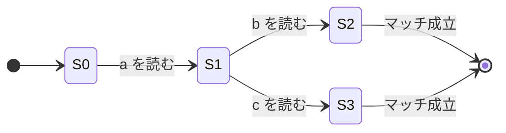

S1 から先は「b でも c でも進める」= 道が分岐している。
この**分岐をどう処理するか**が、正規表現エンジンの方式の分かれ目になる。

NFA はもう一種類の「移動」— **ε 遷移(イプシロン遷移)**も持つ。
文字を読まずに次の状態へジャンプできる特殊な遷移で、
分岐・ループ・アンカー(`^` `$` など)の「文字を消費しない操作」を表現する。
§3.2 の命令セット表で「消費 = **ε**」と書かれているのはこれを指す。

### 3.2 命令セット(`nk_vm_op_t`)

プログラムは「状態」(`nk_vm_state_t`)の配列で、各状態が 1 命令を持つ。

| 命令 | 意味 | 消費 | 主フィールド |
|---|---|---|---|
| `CODE` | コード点 1 個と一致 | 1 文字 | `code`, `check_id` |
| `CHAR_CLASS` | 文字クラスと一致 | 1 文字 | `char_class_index`, `check_id` |
| `DOT` | 任意の 1 文字(`.`) | 1 文字 | `allows_newline`, `check_id` |
| `ASSERTION` | ゼロ幅アサーション | ε | `assertion_type` |
| `CAP_BEGIN` / `CAP_END` | キャプチャ位置記録 | ε | `cap_num` |
| `KEEP` | `\K`(報告するマッチ開始位置をリセット) | ε | — |
| `JUMP` | 無条件 ε 遷移 | ε | `next` |
| `SPLIT` | 優先分岐(`next` 優先、`split_next` 劣後) | ε | `next`, `split_next` |
| `CHECK_VISITED` | ε 経路合流点の重複排除 | ε | `check_id` |
| `MARK_EPSILON` | 空マッチ可能ループ本体への突入を記録 | ε | `check_id`(ε 用 id) |
| `CHECK_EPSILON` | 本体が空マッチなら `split_next`(脱出)、消費していれば `next`(継続) | ε | `check_id`, `next`, `split_next` |
| `BACK_REF` | 後方参照(`\1`/`\k<name>`)とマッチ — キャプチャの長さ分を消費 | 可変 | `cap_num`, `is_ignore_case`, `fold_flags` |
| `LOOKAROUND` | ゼロ幅先読み/後読みアサーション — サブプログラムを実行し成否を判定 | ε | `lookaround_prog_idx`, `lookaround_is_positive`, `lookaround_is_ahead` |
| `POSSESSIVE` | 所有量指定子 — greedy サブプログラムを実行し最大マッチにコミット、バックトラックを提供しない | ε | `possessive_prog_idx` |
| `MATCH` | 受理 | — | `check_id` |

- 「消費 = ε」は文字を読まずに移動できる命令(ε 遷移)。
- `check_id`: 文字消費命令 + `MATCH` + `CHECK_VISITED` に一意採番される
  重複排除キー。ε 閉包内で同じ id を二度通らないために使う。
- `MARK_EPSILON` / `CHECK_EPSILON` の id は別系列で、上限 64
  (スレッドの `epsilon_bits` を `uint64_t` 1 個で持つため。D8)。
- `BACK_REF` は **可変幅**消費命令: 参照先キャプチャの長さ(0 以上)を消費する。
  継続スレッドは通常の 1 文字幅と一致しない場合に `br_deferred_t` で将来位置へ延期。
  `has_back_refs=true` のプログラムはランスキャン最適化と bitset/goto_mask パスを無効化する。

### 3.3 コンパイラ(`src/regex_compile.c`)

#### フラグメントと hole-patching

`compile_node()` は AST ノードを「入口状態 + 未接続の出口(hole)リスト」の
フラグメントに変換する。hole は `(state_index, next か split_next か)` の組で、
後続フラグメントの入口が決まった時点で `patch_all()` が埋める。

- **`patch_all()` は hole が 2 個以上のとき `CHECK_VISITED` を 1 個発行**して
  合流させる(ε 閉包の指数的爆発防止。プロトタイプと同じ)。

#### コンパイル例: `a(b|c)+d`

§3.1 で分岐の説明に使った `a(b|c)` に `+d`(量指定子・後続のリテラル)を加えた
パターン。実際にコンパイルすると次のようになる:

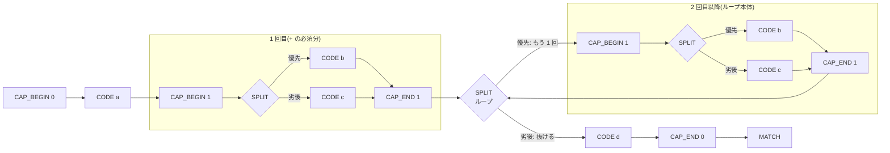

(重複排除用の `CHECK_VISITED` は図では省略。)
`a+` は「1 回分を展開 + ループ」に分解される。greedy なので SPLIT の
**優先側がループ継続**(lazy なら逆)。プログラム全体は必ず
`CAP_BEGIN(0) → 本体 → CAP_END(0) → MATCH` の形になる
(空パターンなら本体なし)。

#### 量指定子の展開規則

- `{min,}` / `{min,max}` は **min 回展開**(child を min 回コンパイルして
  連結)+ 残りを `at_most_n`(max−min 個の SPLIT チェーン)または
  `zero_or_more`(SPLIT 1 個 + ループバック)で構成
- greedy はループ本体を `split.next`(優先)に、lazy(reluctant)は
  `split.split_next` に置く
- **possessive** は greedy バージョンの全体を `nk_program_compile()` でサブプログラムにコンパイルし、`POSSESSIVE` 命令 1 個として格納。実行時に最大マッチを確定してバックトラックを一切提供しない
- **空マッチ可能な本体を持つ無限ループ(`zero_or_more`)のみ**
  `MARK_EPSILON → 本体 → CHECK_EPSILON` で包む(ε 無限ループ防止)。
  有限の `at_most_n` は自然に停止するので包まない(ε id の節約。
  プロトタイプとの意図的な差分)
- 空マッチ可能判定 `node_can_match_empty()`: literal は buf 空、
  消費系は false、assertion/keep は true、quantifier は `min==0 || child`、
  concat は全子、alt はいずれかの子、group/capture は child(NULL は true)

#### 文字クラス(`cc_set_t`)

ソート済み・非重複・両端含む `[lo, hi]` ペア列(inversion list)で構築する。

- `cc_add_range`: 隣接(`lo-1` / `hi+1`)も含めてマージ。プロトタイプ
  `char_class.rb` の `add` と同じアルゴリズム(C 版は線形探索)
- `cc_intersect`: two-pointer、`cc_negate`: 全体集合 `[0, 0x10FFFF]` との差
- クラスノードの構造は「union(項目の和)を `&&` で intersect、最後に
  `[^...]` なら negate」。ネストクラスは再帰
- 文字プロパティ(`\w` `\d` `\s` `\h`、POSIX、`\p{...}`)は
  `nk_enc_get_cprop_code_range()` で取得:
  - `NK_ENC_NO_DELEGATION`: intervals(**len はペア数**)をコピー
  - `NK_ENC_7BIT_DELEGATE` / `8BIT`: `0..0x7F` / `0..0xFF` を
    `nk_enc_code_is_cprop()` で列挙
  - ascii_only(`a` フラグ等)なら `[0,0x7F]` と intersect、
    負(`\D` 等)なら negate
- マッピング: `\w`→`NK_CPROP_WORD`、`\d`→`DIGIT`、`\s`→`SPACE`、
  `\h`→`XDIGIT`。POSIX は同名 cprop(`[[:word:]]`→`WORD`、
  `[[:punct:]]`→`PUNCT`)
- 実行時用に `nk_vm_char_class_t` へ変換: ranges コピー + ASCII 高速パスの
  `uint64_t ascii_bits[2]` ビットマップ(D5)

#### リテラル

`nk_pbuf_t` のバイト列をコンパイル時に `nk_enc_scan_mbc_width` /
`nk_enc_decode_mbc` でデコードし、コード点ごとの `CODE` 命令列にする。
コンパイル後のプログラムは AST・パターン文字列から独立する(§1.1)。

#### ケースフォールディング(`/i` フラグ)

`/i` フラグ付きコンパイルは、fold の種類ごとに異なる戦略を採る。

| フラグ | 種類 | 戦略 |
|--------|------|------|
| `NK_FOLD_ASCII_ONLY` | A-Z ↔ a-z のみ | **実行時 fold**: `CODE` 状態に `is_ignore_case` を付与し、VM が `tolower()` 相当で両辺を比較 |
| `NK_FOLD_DEFAULT` (Simple) | 1対1 Unicode fold(ä↔Ä 等) | **実行時 fold**: 同上。`nk_enc_get_case_fold()` で両辺を fold して比較 |
| `NK_FOLD_FULL` | 1対多 Unicode fold(ß→ss 等) | **コンパイル時展開**: `compile_full_fold_seq()` で交替形 NFA に展開 |
| `NK_FOLD_TURKISH_AZERI` | トルコ語/アゼルバイジャン語 fold | **コンパイル時展開**: `compile_full_fold_seq()` で展開(I↔ı 等) |

**ASCII-only / Simple fold のリテラル**: `CODE` 状態に `is_ignore_case = true` と `fold_flags` を付与する。VM の `state_matches_code()` が実行時に fold して比較する。

**文字クラスのケースフォールディング**: fold 種別によらずコンパイル時に `cc_set_t` を展開する。

- `NK_FOLD_ASCII_ONLY`: `cc_ascii_fold_expand()` — A-Z ↔ a-z の対を `cc_set_t` に追加
- それ以外: `cc_simple_fold_expand()` — `nk_enc_iterate_case_fold()` で全ペアをスキャン

`cc_simple_fold_expand()` のコールバックは `fold_len != 1` をスキップするため、単純展開では 1対多 fold を `cc_set_t` に追加できない。代わりに `compile_cc_with_multi_fold()` が `NK_FOLD_FULL` / `NK_FOLD_TURKISH_AZERI` 有効時に以下の処理を追加する:

1. `nk_enc_iterate_case_fold()` でクラス内コードポイントの multi-char fold を収集(重複除去)
   - 例: `[ß]/i` → ß・ẞ 両方が [s, s] にフォールドするが dedup して 1 件
2. 収集した各 fold 列を `compile_full_fold_seq()` でコンパイル
3. 代替案の state index が確定した後に SPLIT チェーンを後置し全代替を接続

`compile_char_class`・`compile_char_type`(`\w`/`\d` 等)・`compile_char_prop`(`\p{...}`) の 3 関数すべてがこのヘルパーを共用する。

**Full fold のリテラル展開アルゴリズム(`compile_full_fold_seq`)**:

```
1. パターン literal を get_case_fold() で正規化 → folded_codes[]
   例: "ß" → [s, s]   "iß" → [i, s, s]

2. folded_codes[] を再帰的に処理:
   各位置 p で…
     a. identity = folded_codes[p] そのもの (len=1)
     b. expand_case_unfold(folded_codes[p..], FULL) で追加の code point を取得
        例: [s, s] → {S(len=1), ß(len=2)} を返す
     c. identity + expand 結果 = 交替形リスト
        例: [s, s] → {s(len=1), S(len=1), ß(len=2)}

     ─── 指数爆発防止 ───
     d. 同じ len を持つ交替形は継続を 1 回だけコンパイルして共有
        (len=1 の s/S は同じ cont[p+1] を参照 → 線形状態数)
     ─────────────────

     e. SPLIT チェーン + CODE ステートとして emit
        CODE.next = 共有された継続の initial state

3. 生成された NFA は通常の CODE ステート(is_ignore_case=false)なので VM 無改修
```

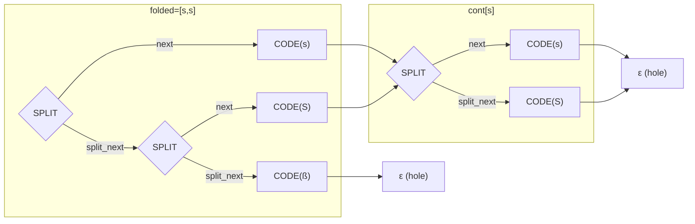

(共有された `cont[s]` を s と S の両 CODE が参照することで状態数が O(folded\_len) になる。)

#### エラー方針

- 未対応機能はノード種別ごとに `NK_ERR_UNSUPPORTED_*`(-600 番台)を返す
  (§5.3 の一覧)
- エラー span は**最内ノード**の `span_offset` / `span_length` を採用
  (ディスパッチャでラップし、最初にエラーを返した深さで記録。
  `has_error_span` フラグで外側の上書きを防ぐ)
- プロジェクト規約どおり offset と length の両方を必ず返す

### 3.4 二大方式: バックトラッキング vs Pike VM

| 観点 | バックトラッキング方式<br/>(Oniguruma / Onigmo / 多くのエンジン) | Pike VM 方式<br/>(RE2 / Rust regex / **Naraku**) |
|---|---|---|
| 分岐の進め方 | 1 本の道を奥まで試し、行き止まりなら**戻って**(backtrack)別の道を試す | 分岐したら**全部の道を同時に**、1 文字ずつ並走させる |
| 最悪の実行時間 | **指数的**(道の組み合わせが爆発する) | 常に **O(文字列長 × プログラムサイズ)** |
| ReDoS(後述) | 起こり得る | **構造的に起こらない** |
| 後方参照 `\1`・先読み | 実装しやすい | 素直には実装できない(工夫が要る) |
| 使うメモリ | 戻り先を覚えるスタック | 並走中の「スレッド」リスト(プログラムサイズに比例) |

どちらが優れているという話ではなく**トレードオフ**である。
Onigmo は機能の豊富さ(後方参照・先読みなど)を取り、
Naraku は安全な実行時間を取った(理由は §2 参照)。

> **DFA(決定性有限オートマトン)とは**: NFA の「分岐しない」バリアント。
> 各状態から読める文字に対して**次状態が 1 つに決まる**ため実行が速いが、
> NFA から DFA を構築すると状態数が指数的に増える場合がある。
> Naraku の Ruby プロトタイプは **Lazy DFA** 方式(実行時に NFA 状態集合 → DFA 状態を
> 遅延計算してキャッシュ)を採用しており、§5・§6 のベンチマークで比較対象として登場する。

### 3.5 ReDoS — バックトラッキングの弱点

ReDoS は「繰り返し」と「分岐」の組み合わせで起こるため、これも §1.2 の例(繰り返し・
分岐を持たない)では実演できない。§3.1・§3.3 で使った `a(b|c)+d` も繰り返しと分岐を
両方持つが、`b` と `c` は読む文字が違うため選択に曖昧さがなく、これも実演には使えない。
ReDoS には「同じ1文字を複数の選択肢が消費できる」曖昧さが要るため、ここだけ別例として
`(a|a)*$` を使う。このパターンを
`"aaaa...a"`(末尾に `$` を満たさない文字)に適用すると、バックトラッキング方式では
各 `a` を「左の `a` で読むか、右の `a` で読むか」の2択を、1文字進むごとに**さらに
2倍**しながら積み重ねる(1文字目で2択、2文字目で4択、3文字目で8択 …)。

n 文字で **2ⁿ 通り**の道ができ、「マッチしない」と答えるには全部の道を
試して全部失敗する必要がある。30 文字で 2³⁰ ≈ 10 億通り——これが
**ReDoS(Regular expression Denial of Service)**: 細工した入力でサービスを
応答不能にする攻撃である。

Pike VM は同じ位置にいる重複した道を 1 つにまとめながら全道を同時に進める
ため、道の数がプログラムサイズを超えて増えない。**どんなパターンでも実行
時間が入力長に比例**し、この攻撃自体が成立しない。

### 3.6 Pike VM 実行器(`src/regex_vm.c`)

#### 全体の動き

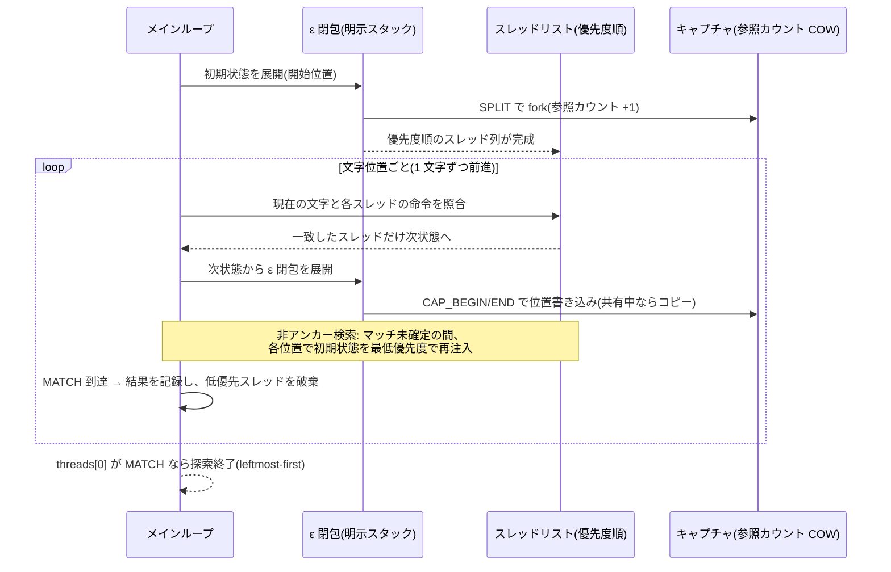

#### スレッドとキャプチャ(COW)

- スレッド = `{ state_index, keep_pos, epsilon_bits, caps* }`
- caps は参照カウント式 COW: `caps_t { uint32_t refcount; size_t data[]; }`
  (C99 flexible array member)。SPLIT で fork(refcount++)、書き込み時に
  refcount > 1 ならコピー(D6)
- `data` レイアウトは `[begin_0, end_0, begin_1, end_1, ...]`、
  **バイトオフセット**(プロトタイプは文字位置だが C API は Onigmo 流)。
  未設定は `NK_REGION_POS_NONE`(SIZE_MAX)
- マッチ確定時の materialize で `data[0] = keep_pos`(`\K` 対応)

#### ε 閉包(反復・明示スタック)

再帰せず明示スタックで実装する(D7)。

- 作業アイテム = `{ is_mark, state_index, keep_pos, epsilon_bits, caps* }`
- SPLIT は **split_next → next の順で push**(LIFO で next 側が先に処理され
  優先度が保存される)。caps は fork し、原本を split_next 側へ
- CHECK_VISITED: visited 済みなら枝刈り。未訪問なら「mark するアイテム」を
  先に push してから next を push(= post-order でマーク。プロトタイプの
  「再帰後にマーク」と同じ)
- visited 判定は `num_check_ids` 長の配列 + visit トークン(世代カウンタ)を
  インクリメントして使い回す
- MARK_EPSILON: `epsilon_bits |= 1 << id`。CHECK_EPSILON: bit が立っていれば
  split_next(脱出)のみ、立っていなければ next(継続)のみ。bit は文字を
  消費した時点でクリア(次位置の閉包は bits=0 から)

#### メインループ(ストリーム処理)

- `prev_code` / `curr_code` / `next_code` の 3 文字窓を維持
  (`NO_CHAR = UINT32_MAX` を番兵に)。アサーション評価に使う
- 各文字境界で: 現スレッド列のうち現在文字に一致する消費命令のスレッドを
  次位置へ進め、ε 閉包を取って次スレッド列を構成 → スワップ
- **非アンカー検索**: マッチ未確定の間、各位置で初期状態を最低優先度で再注入
- スレッドが MATCH に到達したら region を確定し、それより低優先のスレッドを
  破棄。`threads[0]` が MATCH なら探索終了
- 不正バイト列は `NK_ERR_INVALID_BYTE_SEQUENCE`

#### アサーション評価

| 種別 | 条件 |
|---|---|
| `^` | `pos == 0 \|\| prev == '\n'` |
| `$` | 末尾 `\|\| curr == '\n'` |
| `\A` | `pos == 0` |
| `\z` | 末尾 |
| `\Z` | 末尾 `\|\| (curr == '\n' && その直後が末尾)` |
| `\G` | `pos == start_pos` |
| `\b` / `\B` | `is_word(prev) != is_word(curr)` / 同値。`is_word` は `nk_enc_code_is_cprop(enc, code, NK_CPROP_WORD)`(ASCII 版は `code < 0x80 &&`) |

#### 後方参照(`BACK_REF`)

後方参照はキャプチャが確定した位置でなければ評価できない(参照先が未確定の場合は false 扱い)。また消費バイト数がキャプチャ長に依存し **可変幅** となる。これを Pike VM の「1 文字ずつ前進」設計に組み込む実装は次の 2 点がポイント。

**① ランスキャン最適化の無効化**

`has_back_refs=true` のプログラムでは、ASCII ランスキャン(CODE/CHAR_CLASS の連続ランを 1 ステップに圧縮する最適化)を **全面無効化** する。ランスキャンは量指定子ループ(`a+` 等)内でのみ正しく、キャプチャ境界やバックレファレンスが絡むとキャプチャ位置がずれる。同様に greedy スキャンが量指定子を最大幅で消費すると NFA が中間分割を探索できなくなるため(例: `(\w+)\k<name>` で word="hello" の分割が試せなくなる)、バックレファレンス付きパターンでは走査は常にスレッドリストを使う。

**② 可変幅スレッドの延期(`br_deferred_t`)**

`BACK_REF` がキャプチャ `cap_len` バイトにマッチしたとき、`new_pos = pos + cap_len` が現在の `advance_pos`(= `pos + curr_width`)と一致しないことがある。

- `new_pos == advance_pos`(1 文字丁度)→ 継続スレッドをそのまま `next_threads` に追加(ゼロオーバーヘッド)
- `new_pos != advance_pos`(0 バイト or 複数バイト)→ `br_deferred_t` に `(new_pos, state_index, keep_pos, caps)` を記録し、外部ループの先頭で `pos == new_pos` になったときに `threads` へ注入

```
br_deferred_t:
  slots[]  ← (pos, state_index, keep_pos, caps*) の可変長配列
  len      ← 使用中スロット数
```

外部ループは `deferred.len > 0` の間も継続する(while 条件に組み込み済み)。
これにより O(n×m) の Pike VM 保証を維持しながら可変幅バックレファレンスを正確に実行できる。

**③ case-insensitive マッチング(`back_ref_match`)**

折り畳み比較は `back_ref_match()` が担う。fold なし・ASCII fold・Simple fold・Full fold(ß→ss 等 1-to-N)のいずれにも対応し、双方のコード点ストリームをキューで並走させて 1 対 1 に比較する。Full fold では最大 `NK_ENC_MAX_FOLDED_CODES`(3)コード点に展開しうる。

**④ 複数同名キャプチャの優先順位(BR1 修正)**

`(?<name>a)|(?<name>b)\k<name>` のように同名グループが複数ある場合、バックレファレンスは **最後に定義されたグループを優先的に試みる** という Onigmo 互換の動作を実装する。コンパイラは capture_nums を逆順に並べた SPLIT チェーンを生成し、実行時には優先分岐として処理される。

#### 先読み・後読み(`LOOKAROUND`)

ゼロ幅アサーション `(?=)` `(?!)` `(?<=)` `(?<!)` は **サブプログラム方式** で実装する。

**コンパイル時**: アサーション本体を再帰的に `nk_program_compile()` で独立したサブプログラム(`nk_program_t`)にコンパイルし、親プログラムの `sub_programs[]` 配列に格納する。`LOOKAROUND` 命令はそのインデックス・正負・前後を保持する。

**実行時(ε 閉包内)**: `closure()` が `LOOKAROUND` に到達すると:

- **先読み(`is_ahead=true`)**: `nk_program_search()` を現在位置(`closure_pos`)から呼び出し、得られた `region.caps[0] == closure_pos` なら「開始位置が合っている」と判断。positive なら通過、negative なら棄却。
- **後読み(`is_ahead=false`)**: `try_start = 0..closure_pos` を順に試し `region.caps[1] == closure_pos`(終了位置が現在位置)が得られた時点で成否判定。O(n²) だが現実的なパターンサイズでは問題ない。

サブプログラムは `nk_program_free()` で再帰的に解放される。goto_mask(bitset パス)はサブプログラムを含む親プログラムでは無効化される。

#### 所有量指定子(`POSSESSIVE`)

`a*+` `a++` `a?+` `a{m,n}+` のような所有量指定子は **greedy サブプログラム方式** で実装する。

**コンパイル時**: 量指定子ノードを shallow copy して type を `GREEDY` に変え、`nk_program_compile()` でサブプログラムにコンパイル。親プログラムの `sub_programs[]` に格納し、`POSSESSIVE` 命令 1 個がそのインデックスを持つ。

**実行時(ε 閉包内)**: `closure()` が `POSSESSIVE` に到達すると:

1. `nk_program_search(sub_prog, subject, end, closure_pos, &region)` を呼び出す
2. `region.caps[0] == closure_pos`(マッチが現在位置から始まる)でなければ棄却
3. `region.caps[1] == closure_pos`(0 文字マッチ)なら ε 遷移(`push_state(state->next, ...)`)
4. `region.caps[1] > closure_pos`(N 文字マッチ)なら `poss_pending` に `(target_pos=caps[1], state->next, keep_pos, caps)` を記録

**`poss_pending` 側リスト**: `closure()` は単一の明示スタックを使うため、再帰呼び出しでスタックを壊せない。`poss_pending_t` は `(target_pos, state_index, keep_pos, caps*)` を保持し、メインループが `advance_pos == target_pos` になった時点で `closure()` を呼んで継続させる。すでに earlier start のマッチが記録されている(`vm.has_match && match_keep_pos < keep_pos`)場合は低優先度エントリをスキップして正しい leftmost-first を保証する。

---

## 4. mruby バインディング

```mermaid
%%{init: {"flowchart": {"nodeSpacing": 4, "rankSpacing": 8}}}%%
flowchart LR
    subgraph patG[" "]
        direction TB
        Pat["パターン文字列"]
        PatEx["例: (?&lt;hour&gt;\d{2}):(?'minute'\d{2})"]:::ex
    end

    subgraph subjG[" "]
        direction TB
        Subj["対象文字列"]
        SubjEx["例: 14:30"]:::ex
    end

    subgraph compile["コンパイル(1回だけ)"]
        direction LR
        subgraph parserG[" "]
            direction TB
            Parser["①パーサー"]
            ParserEx["例: トークン列に分解"]:::ex
        end
        subgraph astG[" "]
            direction TB
            AST["②AST"]
            ASTEx["例: (hour:2桁)・:・(minute:2桁)\nの構文木"]:::ex
        end
        subgraph ppG[" "]
            direction TB
            PP["③後処理"]
            PPEx["例: hour→#1, minute→#2\nに名前解決"]:::ex
        end
        subgraph vmcG[" "]
            direction TB
            VMC["④VMコンパイラ"]
            VMCEx["例: 各キャプチャをCAP_BEGIN/END\nで囲み命令化"]:::ex
        end
        Parser --> AST
        AST --> PP
        PP --> VMC
    end

    Pat --> Parser
    subgraph progG[" "]
        direction TB
        Prog["⑤NFAプログラム"]
        ProgEx["例: キャプチャ命令込みのバイトコード"]:::ex
    end
    VMC --> Prog

    subgraph execG[" "]
        direction TB
        Exec["⑥実行: Pike VM"]
        ExecEx["例: 位置0から「14:30」にマッチ"]:::ex
    end
    Prog --> Exec
    Subj --> Exec

    subgraph binding["言語バインディング(マッチのたび、2系統が⑤を使う)"]
        direction LR
        subgraph mrbG[" "]
            direction TB
            Mrb["⑦mruby バインディング\n(フル機能)"]:::current
            MrbEx["例: re.match(「14:30」)"]:::ex
        end
        subgraph crbG[" "]
            direction TB
            Crb["⑧CRuby ネイティブ拡張\n(ベンチ専用、match?のみ)"]
            CrbEx["例: re.match?(「14:30」)"]:::ex
        end
    end

    Exec --> Mrb
    Exec --> Crb

    subgraph resultG[" "]
        direction TB
        Result["マッチ結果"]:::current
        ResultEx["例: hour=「14」 minute=「30」"]:::ex
    end
    subgraph result2G[" "]
        direction TB
        Result2["マッチ結果"]
        Result2Ex["例: true"]:::ex
    end
    Mrb --> Result
    Crb --> Result2

    classDef current fill:#cfe8ff,stroke:#1f6feb,color:#0d3a6b,stroke-width:3px
    classDef ex fill:none,stroke:none,color:#8c6d00
    classDef invis fill:none,stroke:none
    class patG,subjG,parserG,astG,ppG,vmcG,progG,execG,mrbG,crbG,resultG,result2G invis
```

### 4.1 呼び出しの流れ

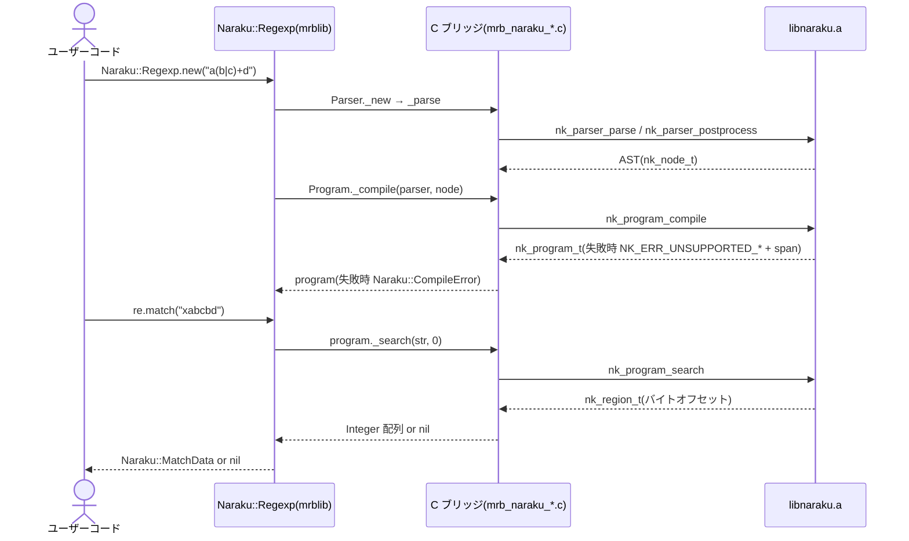

### 4.2 公開 API

```ruby
# コンパイル
re = Naraku::Regexp.new("a(b|c)+d")           # Naraku::CompileError を raise することがある

# マッチ
md = re.match("xabcbd")                        # => Naraku::MatchData or nil
md[0]          # => "abcbd"  (マッチ全体)
md[1]          # => "b"      (キャプチャグループ 1)
md.byte_begin(0)  # => 1
md.byte_end(0)    # => 6
md.pre_match   # => "x"
md.post_match  # => ""
md.captures    # => ["b"]

re.match?("xabcbd")  # => true
re =~ "xabcbd"       # => 1  (マッチ開始バイトオフセット)

# 名前付きキャプチャ
re2 = Naraku::Regexp.new("(?<year>\\d{4})-(?<month>\\d{2})-(?<day>\\d{2})")
md2 = re2.match("2024-06-13")
md2[:year]           # => "2024"  (Symbol キー)
md2['month']         # => "06"    (String キー)
md2[:day]            # => "13"
md2[1]               # => "2024"  (整数インデックスも引き続き有効)
md2.names            # => ["year", "month", "day"]
md2.named_captures   # => {"year"=>"2024", "month"=>"06", "day"=>"13"}

# 対話型テスター
# bin/mruby tools/match.rb PATTERN SUBJECT
# bin/mruby tools/match.rb  (REPL モード)
```

### 4.3 実装メモ

- `Naraku::Program._compile(parser, node)` → C 側で
  `nk_program_compile(parser->enc, node, parser->num_capture_groups, ...)`。
  失敗時は `Naraku::CompileError`(offset/length 付き、`ParseError` と
  同形式のメッセージ整形)
- `program#_search(string, byte_start)` → マッチ時はバイトオフセットの
  Integer 配列、非マッチは nil
- `mrb_data_type` + free hook で `nk_program_t` を解放(`mrb_naraku_parser.c`
  のパターン踏襲)
- キャプチャ配列は flat Integer 配列 `[begin_0, end_0, begin_1, end_1, ...]`
  で渡す。`NK_REGION_POS_NONE`(SIZE_MAX)は nil に変換

### 4.4 機能別 E2E ハンズオン

```
bin/mruby tools/match.rb PATTERN SUBJECT   # 1 ショット実行
bin/mruby tools/match.rb                   # REPL モード(Ctrl-D で終了)
```

以下の例はすべて実際の出力をそのまま記載している。

#### 基本マッチング・グループキャプチャ

```
$ bin/mruby tools/match.rb 'a(b|c)+d' 'xabcbd'
  pattern : /a(b|c)+d/
  subject : "xabcbd"
  match   : "abcbd"  [1...6]
  [1]         : "b"
  pre     : "x"
  post    : ""
```

#### 名前付きキャプチャ

```
$ bin/mruby tools/match.rb '(?<year>\d{4})-(?<month>\d{2})-(?<day>\d{2})' '2024-06-13'
  pattern : /(?<year>\d{4})-(?<month>\d{2})-(?<day>\d{2})/
  subject : "2024-06-13"
  match   : "2024-06-13"  [0...10]
  [1] :year   : "2024"
  [2] :month  : "06"
  [3] :day    : "13"
  pre     : ""
  post    : ""
```

`captures` / `names` / `named_captures` は `bin/mruby -e` で確認:

```
$ bin/mruby -e '
  re = Naraku::Regexp.new("(?<y>\\d{4})-(?<m>\\d{2})")
  md = re.match("2024-06")
  p md.names           # => ["m", "y"]
  p md.named_captures  # => {"m"=>"06", "y"=>"2024"}
'
["m", "y"]
{"m" => "06", "y" => "2024"}
```

#### アンカー (`^` `$` `\A` `\z` `\b` `\G`)

```
$ bin/mruby tools/match.rb '^\d+$' '42'
  pattern : /^\d+$/
  subject : "42"
  match   : "42"  [0...2]
  pre     : ""
  post    : ""

$ bin/mruby tools/match.rb '^\d+$' 'abc'
  pattern : /^\d+$/
  subject : "abc"
  result  : no match

$ bin/mruby tools/match.rb '\Ahello' 'hello world'
  pattern : /\Ahello/
  subject : "hello world"
  match   : "hello"  [0...5]
  pre     : ""
  post    : " world"

$ bin/mruby tools/match.rb 'hello\z' 'say hello'
  pattern : /hello\z/
  subject : "say hello"
  match   : "hello"  [4...9]
  pre     : "say "
  post    : ""

$ bin/mruby tools/match.rb '\bword\b' 'a word here'
  pattern : /\bword\b/
  subject : "a word here"
  match   : "word"  [2...6]
  pre     : "a "
  post    : " here"

$ bin/mruby tools/match.rb '\Gsay' 'say hello'
  pattern : /\Gsay/
  subject : "say hello"
  match   : "say"  [0...3]
  pre     : ""
  post    : " hello"
```

#### 文字クラス・文字型 (`[]`、`\w`、`\d`、`\h`、`\p{...}`、POSIX)

```
$ bin/mruby tools/match.rb '[a-zA-Z_]\w*' '  _foo123 '
  pattern : /[a-zA-Z_]\w*/
  subject : "  _foo123 "
  match   : "_foo123"  [2...9]
  pre     : "  "
  post    : " "

$ bin/mruby tools/match.rb '\d+' 'price: 42yen'
  pattern : /\d+/
  subject : "price: 42yen"
  match   : "42"  [7...9]
  pre     : "price: "
  post    : "yen"

# \h — 16 進数字 [0-9a-fA-F]
$ bin/mruby tools/match.rb '#\h{6}' 'color: #ff8800;'
  pattern : /#\h{6}/
  subject : "color: #ff8800;"
  match   : "#ff8800"  [7...14]
  pre     : "color: "
  post    : ";"

# \p{Lu} — Unicode 大文字カテゴリ
$ bin/mruby tools/match.rb '\p{Lu}+' 'hello WORLD'
  pattern : /\p{Lu}+/
  subject : "hello WORLD"
  match   : "WORLD"  [6...11]
  pre     : "hello "
  post    : ""

# POSIX クラス [[:digit:]]
$ bin/mruby tools/match.rb '[[:digit:]]+' 'abc123def'
  pattern : /[[:digit:]]+/
  subject : "abc123def"
  match   : "123"  [3...6]
  pre     : "abc"
  post    : "def"
```

#### 非捕捉グループ・拡張モード・コメント

```
# (?:...) — キャプチャしないグループ
$ bin/mruby tools/match.rb '(?:foo|bar)+' 'foobarfoo!'
  pattern : /(?:foo|bar)+/
  subject : "foobarfoo!"
  match   : "foobarfoo"  [0...9]
  pre     : ""
  post    : "!"

# (?x) — 拡張モード: 空白とコメントを無視
$ bin/mruby tools/match.rb '(?x) \d{4} - \d{2} - \d{2}' '2024-06-13'
  pattern : /(?x) \d{4} - \d{2} - \d{2}/
  subject : "2024-06-13"
  match   : "2024-06-13"  [0...10]
  pre     : ""
  post    : ""

# (?#...) — インラインコメント
$ bin/mruby tools/match.rb '\d+(?#digits)' 'code: 42'
  pattern : /\d+(?#digits)/
  subject : "code: 42"
  match   : "42"  [6...8]
  pre     : "code: "
  post    : ""
```

#### `\K` マッチ開始位置リセット

```
$ bin/mruby tools/match.rb 'foo\Kbar' 'foobar'
  pattern : /foo\Kbar/
  subject : "foobar"
  match   : "bar"  [3...6]
  pre     : "foo"
  post    : ""
```

#### 先読み・後読み

```
$ bin/mruby tools/match.rb '(?=foo)' 'foobar'
  pattern : /(?=foo)/
  subject : "foobar"
  match   : ""  [0...0]
  pre     : ""
  post    : "foobar"

$ bin/mruby tools/match.rb '\d+(?=px)' 'width:42px;'
  pattern : /\d+(?=px)/
  subject : "width:42px;"
  match   : "42"  [6...8]
  pre     : "width:"
  post    : "px;"

$ bin/mruby tools/match.rb '(?<=foo)bar' 'foobar'
  pattern : /(?<=foo)bar/
  subject : "foobar"
  match   : "bar"  [3...6]
  pre     : "foo"
  post    : ""

$ bin/mruby tools/match.rb '(?<=\d{3})\w+' 'abc123def'
  pattern : /(?<=\d{3})\w+/
  subject : "abc123def"
  match   : "def"  [6...9]
  pre     : "abc123"
  post    : ""
```

#### 後方参照 (`\1`、`\k<name>`)

```
$ bin/mruby tools/match.rb '(\w+)\k<1>' 'hellohello world'
  pattern : /(\w+)\k<1>/
  subject : "hellohello world"
  match   : "hellohello"  [0...10]
  [1]         : "hello"
  pre     : ""
  post    : " world"

$ bin/mruby tools/match.rb '(?<word>\w+)\k<word>' 'hellohello world'
  pattern : /(?<word>\w+)\k<word>/
  subject : "hellohello world"
  match   : "hellohello"  [0...10]
  [1] :word   : "hello"
  pre     : ""
  post    : " world"
```

#### 所有量指定子 (`a*+`、`a++`、`a?+`、`a{m,n}+`)

```
# 一度 a を消費したらバックトラックしない → 直後の a とマッチしない
$ bin/mruby tools/match.rb 'a*+a' 'aaa'
  pattern : /a*+a/
  subject : "aaa"
  result  : no match

$ bin/mruby tools/match.rb 'a++b' 'aaab'
  pattern : /a++b/
  subject : "aaab"
  match   : "aaab"  [0...4]
  pre     : ""
  post    : ""
```

#### `(?>...)` アトミックグループ

```
# 非アトミック: (?:abc|ab)c → "ab" にフォールバックしてマッチ
$ bin/mruby tools/match.rb '(?:abc|ab)c' 'abc'
  pattern : /(?:abc|ab)c/
  subject : "abc"
  match   : "abc"  [0...3]
  pre     : ""
  post    : ""

# アトミック: (?>abc|ab)c → "abc" にコミットしてフォールバックしないのでマッチしない
$ bin/mruby tools/match.rb '(?>abc|ab)c' 'abc'
  pattern : /(?>abc|ab)c/
  subject : "abc"
  result  : no match
```

#### `\R` 改行シーケンス

```
# CRLF を 1 単位として消費する
$ bin/mruby tools/match.rb '\R' $'a\r\nb'
  pattern : /\R/
  subject : "a\r\nb"
  match   : "\r\n"  [1...3]
  pre     : "a"
  post    : "b"

$ bin/mruby tools/match.rb 'a\R+b' $'a\r\n\nb'
  pattern : /a\R+b/
  subject : "a\r\n\nb"
  match   : "a\r\n\nb"  [0...5]
  pre     : ""
  post    : ""
```

#### `/i` フラグ (ケースフォールディング)

`(?i)` インラインフラグで Simple fold(1 対 1 Unicode fold)が有効になる:

```
$ bin/mruby tools/match.rb '(?i)hello' 'Say HELLO World'
  pattern : /(?i)hello/
  subject : "Say HELLO World"
  match   : "HELLO"  [4...9]
  pre     : "Say "
  post    : " World"
```

Full fold(`ß → ss` 等の 1 対多展開)は `Naraku::Regexp.new` のキーワード引数で指定する:

```
$ bin/mruby -e '
  re = Naraku::Regexp.new("ss", Naraku::Encoding::UTF_8,
                           is_ignore_case: true, fold_flags: [:full])
  p re.match?("SS")   # => true
  p re.match?("Ss")   # => true
'
true
true

# 文字クラスでも Full fold が有効(CF3 修正: §1.1 参照)
$ bin/mruby -e '
  re = Naraku::Regexp.new("[ss]", Naraku::Encoding::UTF_8,
                           is_ignore_case: true, fold_flags: [:full])
  p re.match?("SS")   # => true
'
true
```

#### Ruby API の使い方 (`match?`、`=~`、`captures`)

```
$ bin/mruby -e '
  re = Naraku::Regexp.new("\\d+")
  p re.match?("foo123")  # => true  (MatchData を生成しないため高速)
  p re.match?("foobar")  # => false
  p re =~ "foo123"       # => 3   (マッチ開始バイトオフセット)
  p re =~ "foobar"       # => nil
'
true
false
3
nil

$ bin/mruby -e '
  re = Naraku::Regexp.new("(\\d+)-(\\d+)")
  md = re.match("2024-06")
  p md.captures  # => ["2024", "06"]
  p md.to_a      # => ["2024-06", "2024", "06"]
'
["2024", "06"]
["2024-06", "2024", "06"]
```

#### 未対応機能の明示エラー

```
$ bin/mruby tools/match.rb '(?~a+)' 'test'
  compile error: absence groups are not supported in this version (at span 0...6)

$ bin/mruby tools/match.rb '(a)\g<1>' 'aa'
  compile error: sub-expression calls are not supported in this version (at span 3...8)
```


---

## 5. Onigmo との比較

### 5.1 位置づけ

Naraku(奈落)は Oniguruma(鬼車)→ Onigmo(鬼雲)の系譜に連なる
**Ruby 専用の後継エンジン**を目指すプロジェクト。Onigmo は CRuby に長年
組み込まれてきた実績あるエンジンだが、C 実装としての古さ(保守性)と
バックトラッキング方式に由来する ReDoS が構造的課題として残る。

### 5.2 機能比較

| 機能 | Onigmo | Naraku(現行、2026-06-20 時点) | Naraku 将来版 |
|---|---|---|---|
| リテラル・連接・選択 `\|` | ✅ | ✅ | ✅ |
| `.`(任意の 1 文字) | ✅ | ✅ | ✅ |
| 量指定子 `* + ? {m,n}`(greedy/lazy) | ✅ | ✅ | ✅ |
| 文字クラス(範囲・否定・`&&`・POSIX・`\p{...}`) | ✅ | ✅ | ✅ |
| キャプチャ・非捕捉グループ | ✅ | ✅(名前付き含む) | ✅(名前付き含む) |
| アンカー `^ $ \A \z \Z \G \b \B` | ✅ | ✅ | ✅ |
| `\K`(マッチ開始のリセット) | ✅ | ✅ | ✅ |
| possessive 量指定子 `a*+` | ✅ | ✅ | ✅ |
| `/i`(ASCII-only / Simple / Full Unicode fold) | ✅ | ✅ | ✅ |
| 後方参照 `\1` `\k<name>` | ✅ | ✅ | ✅ |
| 先読み・後読み `(?=) (?!) (?<=) (?<!)` | ✅ | ✅ | ✅ |
| アトミックグループ `(?>)` | ✅ | ✅ | ✅ |
| 不在グループ `(?~)`・条件分岐 `(?(...)...)` | ✅ | ❌ 明示エラー | ⭕ 検討 |
| 部分式呼び出し `\g<...>` | ✅ | ❌ 明示エラー | ⭕ 検討 |
| `\R` 改行シーケンス | ✅ | ✅ | ✅ |
| `\X` 書記素クラスタ | ✅ | ❌ 明示エラー | ⭕ 予定 |
| エンコーディング | 約 30 種 | 5 種 | 順次拡張 |
| ReDoS 耐性 | ❌(タイムアウトで緩和) | ✅ 構造的に安全 | ✅ |

### 5.3 できないこと(未対応機能)

§5.2 で ❌ とした機能は**パーサーは受理する**(構文解析は Onigmo 互換で完成済み)
が、**コンパイル時に `NK_ERR_UNSUPPORTED_*` で明示的に失敗**する。黙って違う
結果を返すことはない(§3 の設計判断)。

| 機能 | エラーコード |
|---|---|
| 部分式呼び出し `\g<...>` | `NK_ERR_UNSUPPORTED_SUBEXP_CALL` |
| 不在グループ `(?~)` | `NK_ERR_UNSUPPORTED_ABSENCE_GROUP` |
| 条件分岐 `(?(...)...)` | `NK_ERR_UNSUPPORTED_CONDITIONAL` |
| `\X` 書記素クラスタ | `NK_ERR_UNSUPPORTED_FEATURE` |

これとは別に、**どの構文でも**複雑度が状態数 2¹⁸・ε id 64 を超えると
`NK_ERR_PATTERN_TOO_COMPLEX` になる安全装置がある(機能の欠落ではなく
リソース上限、D8 参照)。

### 5.4 実行方式の理論比較

| 観点 | Onigmo(バックトラッキング) | Naraku(Pike VM) |
|---|---|---|
| 時間計算量 | 平均は高速、**最悪 O(2ⁿ)** | **常に O(n × m)**(n=文字列長, m=プログラムサイズ) |
| 空間計算量 | バックトラックスタック(入力依存で伸びる) | スレッドリスト O(m) + キャプチャ |
| ReDoS | パターン次第で発生 | 発生しない |
| 単純パターンの定数倍 | 軽い(歴代の最適化の蓄積) | スレッド管理のオーバーヘッドあり |
| 機能の実装自由度 | 高い(後方参照・先読みが自然に書ける) | 制限あり(将来はハイブリッド等の工夫が必要) |

実測ベンチマークは §6.3 を参照。


---

## 6. パフォーマンス改善ロードマップ

§6 が扱うのは §1.2 の地図のうち⑥実行(Pike VM)の内部だけ(他の①〜⑤・⑦⑧は対象外)。
下図は §3 と同じ `a(b|c)+d` / `"xabcbd"` の例で §1.2 の地図を描き直し、⑥だけを
ハイライトしたもの。§6.1 の図はこの⑥を**さらにズームした内部構造**にあたる。

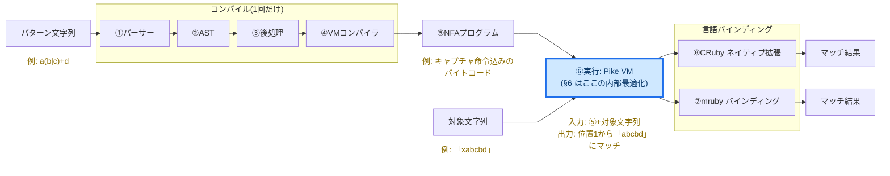

### 6.1 施策の全体像

Pike VM は正確さと ReDoS 耐性を優先した素直な実装をベースに、
3 つのアプローチで Onigmo に近づける。
サイクル名は §6.2 の表・`docs/ja/naraku-performance-highlights.md` の見出しと統一している。

いずれの施策も Pike VM の構造(全分岐を同時に処理し、入力長に比例した時間で動く性質、
§3.4〜§3.5 参照)自体は変更していない。NFA を動かす前に答えを絞る・NFA を丸ごとバイパス
する・NFA 内部の定数倍を縮めるという3段とも「常に正しい結果へ収束する経路」を保ったまま
高速化したものであり、速度を追って ReDoS 耐性を犠牲にした施策は存在しない。

下図全体が §6 冒頭の地図の⑥実行(Pike VM)1箇所の内部に当たる。入力は⑤NFAプログラム+
対象文字列、出力はマッチ可否(`NK_SUCCESS`/`NK_NO_MATCH`)で、これは §6 冒頭の地図の
⑥の入力・出力と同じもの。

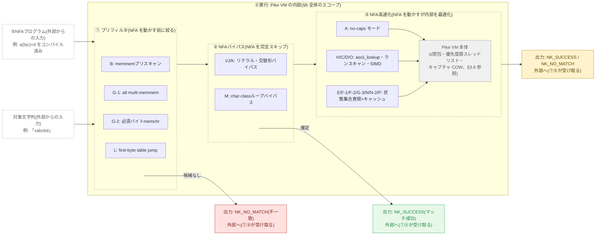

具体例(`a(b|c)+d` / `「xabcbd」`、上の §6 冒頭の地図と同じ): ①プリフィルタは
literal prefix `a` を `memmem` で探す(Cycle B)。見つかるので②へ進むが、`a(b|c)+d` は
純リテラルでも純粋な交替形でもないため②ではバイパスできず、③NFA高速化(bitset 遷移・
Lazy DFA キャッシュ等)で実際に NFA を走らせ、位置1から `「abcbd」` にマッチして
`NK_SUCCESS`(キャプチャ1 = `「b」`)を返す。

F-1(Ruby 実装 Lazy DFA)のみ YJIT/ZJIT の恩恵を受ける。他はすべて C 実装のため JIT と無関係。
各 Cycle の詳細(目的・課題・解決・核心コード)は `docs/ja/naraku-performance-highlights.md`
にこの図と同じ3分類(①②③)でまとめてある。

### 6.2 各サイクルの決定的ポイント

各サイクルは「実装 → ベンチマーク確認 → コミット」を 1 単位とした。
**ここが決定的**列はそのサイクルで最も効いたメカニズムの核心を 1 文で示す。

| Cycle | 施策 | ここが決定的 | 主なターゲット | 代表改善幅 |
|-------|------|------------|-------------|-----------|
| A | no-caps モード + `\A` スキップ | `match?` で caps 配列の malloc を完全排除 | 全パターンの基礎コスト | — |
| B | literal prefix `memmem` | NFA を動かす前にリテラル先頭を `memmem` で検索、開始位置をジャンプ | literal / bounded | non-match 即 return |
| C | CHAR_CLASS ランスキャン | 1スレッド状態のとき文字クラスの連続ランをまとめてスキャン | `[a-zA-Z0-9]+` | +148% |
| D | CODE ランスキャン | 固定バイトのε-next が単純なとき同様に連続ランをスキャン | `a+b` | +392% |
| E | **Thompson NFA bitset** | スレッドリストを廃止。全スレッドを `uint64_t` 1 本に圧縮、分岐が OR 演算 1 回 | ≤63 状態の全パターン | ambiguous +983% |
| F-1 | Lazy DFA (Ruby) | NFA 状態集合 → 次状態集合の遷移をハッシュキャッシュ。同じ状態集合への再計算をゼロに | assertion-free 全パターン | YJIT で +100% |
| F-2 | Lazy DFA (C) | bitset に `(mask, byte) → next_mask` のキャッシュを追加。bitset 演算を繰り返さない | ≤63 状態の全パターン | ambiguous +154% |
| G-1 | 交替形 multi-memmem | 全枝がリテラルの交替形は `memmem` を全枝に並走させ最左位置を先取り | alternation non-match | 即 return |
| G-2 | 必須バイト prefilter | 「どのマッチにも必ず登場する ASCII バイト」を `memchr` で先行確認。なければ即 return | repetition non-match | +33% |
| G-3 | Lazy DFA cache 拡大 | 256→1024 スロット + 75% 充填でリセット。キャッシュヒット率向上 | `(a\|a)+b` | +37% |
| H | ascii_lookup 平坦テーブル | char_class の ASCII 判定を bitset 演算 → 配列 1 ロードに変更。SIMD 自動ベクタライズ | char_class スキャン全般 | 定数倍 ↓ |
| G-4 | YJIT 計測 | LazyDFA+YJIT で ambiguous が Onigmo+YJIT を 1.40x 超えを確認 | — | — |
| I | **リテラル VM バイパス** | 純リテラルは `memmem` の結果がそのまま答え。NFA を一切走らせない | `Watson` 等 | +14% |
| J | **交替形 VM バイパス** | 純 ASCII 交替形は alt pre-scan の最左位置がそのまま答え | `foo\|bar\|baz` | +25% |
| K | **非 ASCII VM バイパス** | 非 ASCII リテラル・交替形も `memmem` バイパスに対応 | `ジョバンニ\|カムパネルラ` | +36% |
| L | **first-byte table jump** | コンパイル時に「有効な先頭バイト集合」を 128 エントリ表で事前計算。NFA 初期状態で候補外バイトをバッチスキップ | bounded non-match | 単発呼び出しで ~297万 ips(§6.3 参照、batches/sec 指標では測定不可) |
| M | **char-class ループバイパス** | `[X]+`/`\w+`/`\d+` は `ascii_lookup` を直接スキャンして NFA を完全排除 | char_class | 0.82x → 0.90x vs Onigmo |
| N | **Thompson NFA bitset 128 状態化** | `goto_mask`/`initial_mask`/lazy DFA キャッシュキーを `uint64_t` 1 本(63 状態上限)から `nk_bitset128_t`(2 本構造体、127 状態上限)に拡張。`__uint128_t` は `-std=c99 -Wpedantic` で使えないため自前の2語構造体で実装 | pathological(64〜127 状態のパターンが汎用スレッドリスト走査からbitset+lazy DFA経路に復帰) | 10 ips → 793 ips(mruby, 約79倍) |
| O | **ASCII ランスキャンの明示的 SIMD 化** | `ascii_lookup` 平坦テーブルへの自動ベクタライズ依存(`-march=native` 必須)をやめ、文字クラスの ASCII メンバーを最大4本の連続バイト範囲に分解し SSE2 の `_mm_min_epu8`/`_mm_max_epu8` で16バイト/回の範囲判定を行う。範囲数が4を超えるクラスはスカラー経路にフォールバック(常に正しい) | char_class / bounded(特に長い入力) | 長い入力(6000バイト)の単発呼び出しで Onigmo+YJIT 比 約95〜100倍 |
| N-2 | **Lazy DFA キャッシュの2経路化(Cycle N の副作用修正)** | Cycle N で `nk_lazy_dfa_slot_t` が 24→40 バイトに肥大化(1024スロットで24KB→40KB、典型的なL1d 32KBに収まらず)していたのを `sizeof()` で発見。≤63状態のプログラムは Cycle N 以前と同じ24バイトスロットの `nk_lazy_dfa_narrow_t` を使い、64〜127状態のプログラムだけ40バイトスロットの `nk_lazy_dfa_t` を使う2経路に分離 | ambiguous / bounded / repetition(小規模パターンの後退を回収) | ambiguous 1.11x→1.25x、bounded 1.09x→1.14x、repetition 0.45x→0.55x(いずれもCExt/Ong) |
| P | **固定点検出による単一バイトランスキャン** | `search_impl_bitset` がすでに計算済みの `next` を再利用し `nk_bitset128_eq(next, active)` だけで固定点判定(追加のビットスキャン無し)。真ならキャッシュ参照を介さずバイト列を直接スキャン。前回のキャッシュ参照前ビットスキャン版は他カテゴリを後退させたため revert していたが、この設計なら後退ゼロで repetition/ambiguous が大幅改善 | repetition / ambiguous | repetition 0.55x→2.90x、ambiguous 1.27x→7.80x(CExt/Ong)。全10カテゴリで Onigmo 超え達成 |

### 6.3 ベンチマーク結果

理論比較は §5.4 を参照。ここでは実測ベンチマーク (`ruby-prototype/benchmark/bench_compare.rb`) を示す。

> 測定環境: CRuby 4.0.5 (plain) / mruby 4.0.0、Dev Container (x86_64)、2026-06-19。
> ips は batches/sec(入力バッチを1秒に何周できるか、高いほど速い)。**CExt/Ong** は
> Naraku の C コア(`ext/naraku/`)を Onigmo と同じ CRuby ランタイム上で比較した列で、
> エンジン自体の優劣を最も公平に表す。

| パターン | Onigmo (ips) | NarakuCExt (ips) | CExt/Ong | PikeVM(mrb) (ips) | VM/Ong |
|---------|------------:|------------------:|--------:|------------------:|-------:|
| `Watson` (literal) | 3,681.0 | 6,012.1 | **1.63x** | 2,550.5 | 0.69x |
| `foo\|bar\|baz` (alternation) | 3,693.2 | 5,165.6 | **1.40x** | 1,893.1 | 0.51x |
| `a+b` (repetition) | 1,682.5 | 4,871.2 | **2.90x** | 2,678.2 | **1.59x** |
| `(a\|a)+b` (ambiguous) | 622.5 | 4,856.5 | **7.80x** | 2,664.8 | **4.28x** |
| `[a-zA-Z0-9]+` (char_class) | 3,866.0 | 8,234.5 | **2.13x** | 3,328.6 | 0.86x |
| `\d{4}-\d{2}-\d{2}` (bounded) | 3,454.4 | 3,712.4 | **1.07x** | 2,306.6 | 0.67x |
| `\d{4}-\d{2}-\d{2}` (bounded non-match) | 4,041.7 | 6,594.2 | **1.63x** | 3,145.4 | 0.78x |
| `(?:a?){30}a{30}` (pathological) | 807.5 | 845.5 | **1.05x** | 750.0 | 0.93x |
| `ジョバンニ\|カムパネルラ` (unicode) | 3,648.6 | 5,829.4 | **1.60x** | 2,714.6 | 0.74x |
| `[a-zA-Z0-9]+` (char_class, 6000 バイト) | 604.8 | 4,209.3 | **6.96x** | 3,057.2 | **5.05x** |

**読み方:**
- **CExt/Ong(エンジン本体の公平な比較)は全10カテゴリで 1.0x 超** — Onigmo を上回った。特に
  `ambiguous`(バックトラッキングの指数的な分岐を O(1) に圧縮)と `repetition`(固定点
  ランスキャンでキャッシュ参照すら不要にする、Cycle P)で伸びが大きい。
- `PikeVM(mrb)` は mruby(JIT 非搭載)での実測。`repetition`/`ambiguous`/`pathological`/
  `char_class_long` は 1.0x を超えるが、`literal`/`alternation`/`char_class`/`bounded`/
  `unicode` は mruby 呼び出し自体のオーバーヘッドにより 1.0x 未満 — エンジンの問題ではなく
  batches/sec 指標の限界。単発呼び出しのタイトループで計測すると `char_class_long` の
  ような長い入力で Onigmo(CRuby+YJIT)比 約95〜100倍に達する。
- `pathological` — Cycle N(bitset 128 状態化)により 64 状態超のパターンも bitset 経路に
  乗るようになった。CExt/Ong は **1.05x**(Cycle N 以前は 0.01x)。

**設計上の決断ポイント**(`nk_bitset128_t` を2語構造体にした理由・Lazy DFA キャッシュを
narrow/wide に分離した理由・固定点判定を「キャッシュ参照後」に行う理由・first-byte table
の fold バグの経緯)は `docs/ja/naraku-performance-highlights.md` の Cycle N / N-2 / P
カードで核心コード付きで解説済みのため、ここでは重複させない。

**今後の課題**: Cycle Q(小規模パターンの ahead-of-time full DFA)・Cycle R
(computed-goto dispatch)は調査のみ行い、中〜低優先度と判断して未実装。

